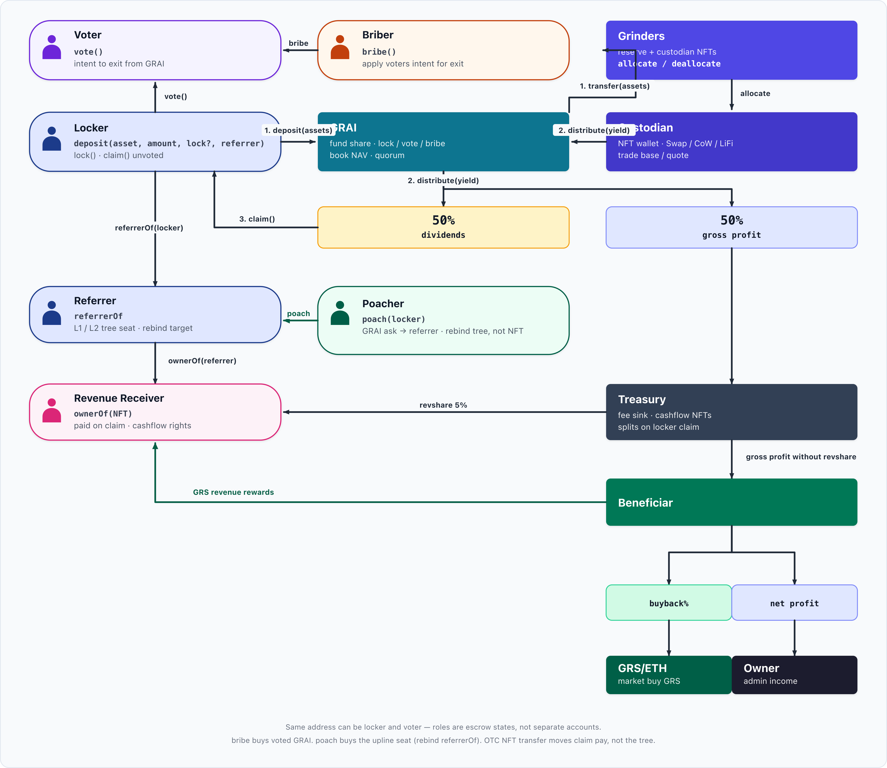
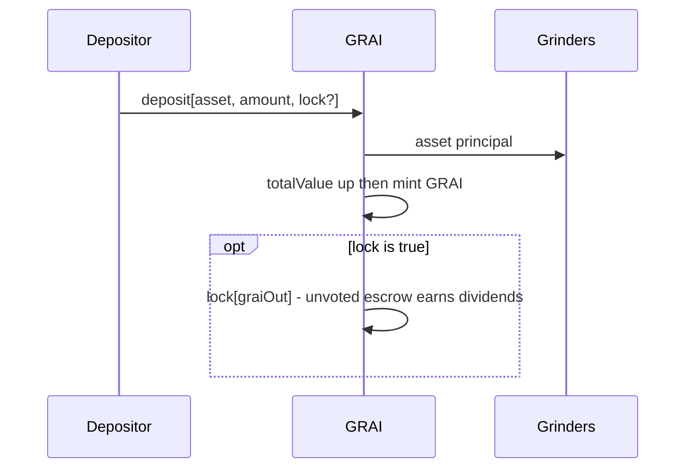
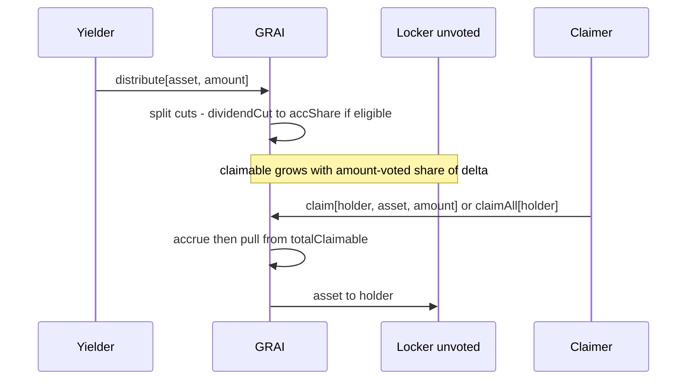
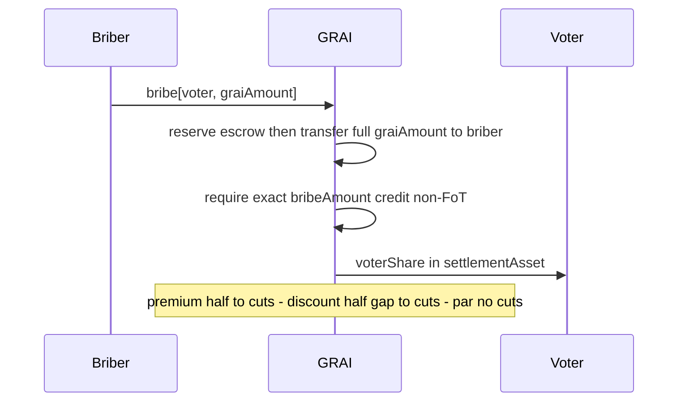
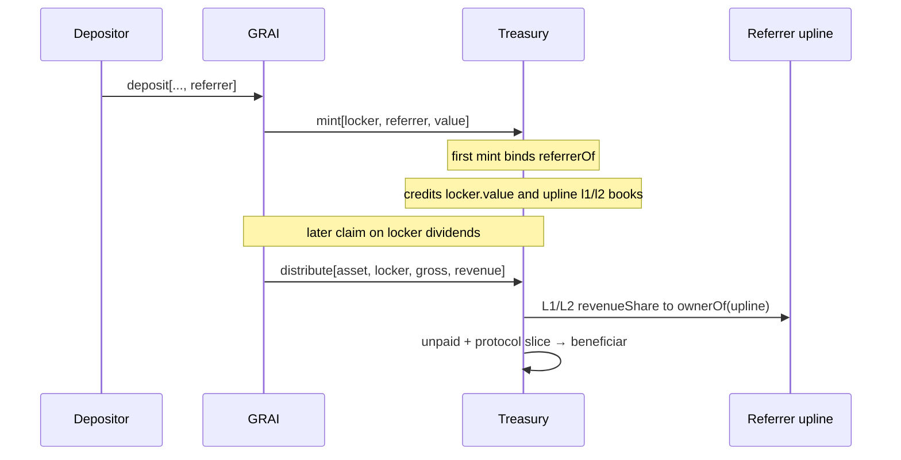

# GRAI Tokenomics — Protocol Overview

The key words **MUST**, **MUST NOT**, **REQUIRED**, **SHALL**, **SHALL NOT**, **SHOULD**, **SHOULD NOT**, **RECOMMENDED**, **NOT RECOMMENDED**, **MAY**, and **OPTIONAL** in this document are to be interpreted as described in [RFC 2119](https://www.rfc-editor.org/rfc/rfc2119) and [RFC 8174](https://www.rfc-editor.org/rfc/rfc8174).

Report derived from on-chain logic in `[GRAI.sol](../src/GRAI.sol)`, `[Treasury.sol](../src/Treasury.sol)`, and `[Grinders.sol](../src/Grinders.sol)` (EVM implementation, July 2026). Integration happy path: `[test/GRAILifecycle.t.sol](../test/GRAILifecycle.t.sol)`. Affiliate / claim-time split: `[test/TreasuryReferrals.t.sol](../test/TreasuryReferrals.t.sol)`. Poach / tree book: `[test/TreasuryPoach.t.sol](../test/TreasuryPoach.t.sol)`.

---

## 1. Executive summary

**GRAI** (*Grinders Artificial Index*) is a USD-denominated fund-share ERC20 (6 decimals). Depositors mint shares at **book value**. Capital sits in **Grinders**; custodian wallets (NFT-controlled) generate yield.

**Role ladder**

```
holder  →  lock()  →  locker (unvoted)  →  vote()  →  voter  ←  bribe()  ←  briber
              │              │               │
              │         earn dividends     no asset dividends
              │     (escrow.amount − voted)  quorum / bribe market
```

- **Dividends** accrue only on **unvoted** locked GRAI: `escrow.amount − escrow.voted` (index over `totalLocked − totalVoted`).
- **Vote** has an opportunity cost: voted GRAI leaves the dividend base.
- A holder may `vote` without a prior `lock`: `vote` locks any wallet shortfall so `voted ≤ amount`.
- `**distribute()**` — permissionless yield in; splits per `Config` cuts (see table below). Same cut path used for bribe premium / discount carve-outs.
- `**bribe()**` — permissionless buyout of **voted** GRAI for `settlementAsset` at dynamic ask vs half-quorum.

**Exit paths (no open-market redeem while live)**

1. `unlock` — return locked GRAI to the wallet (clamps `voted ≤ amount`); early unlock penalty stays on GRAI as orphan/dead inventory (scooped to the liquidation opener via `balanceOf(this) − totalLocked`).
2. `bribe` — buy out **voted** GRAI for `settlementAsset` at a dynamic ask vs half-quorum (premium / par / discount).
3. **Secondary market** — sell free (unlocked) wallet GRAI OTC / CEX / DEX; protocol does not provide a live redeem.
4. **Liquidation** — `Regime { GRINDING, REDEMPTION }`. Open is **2-of-2**: `hasQuorum()` on `GRAI.liquidate` **and** `Grinders.confirmed`. Arm via `grinders.owner()` `confirm()`. Open flips `regime = REDEMPTION` **before** nested sweeps so `Grinders.liquidate` can require `grai.liquidation()` (no GRINDING-time sweeps). After `liquidationPeriod` holders `redeem` → after `+ redeemPeriod` anyone `revive` → `GRINDING` (clears arm). Hard sweep failure aborts open (rolls regime back). Voters alone cannot open.

**Yield (**`distribute`**) / bribe premium** splits per `Config` (initialize defaults **50% / 50%**):


| Cut      | Default                | Destination                                                    |
| -------- | ---------------------- | -------------------------------------------------------------- |
| Dividend | `dividendCutBps` 50%   | Unvoted lockers via `assets[asset].accShare` → `claim`         |
| Treasury | `treasuryCutBps` 50%   | `treasury` (affiliates paid later on `claim`; see §10)         |


If there are **no unvoted locks** (`totalLocked == totalVoted`), or the cut is too small to move the index, the dividend cut is **sent to treasury** instead. When the index moves, `totalClaimable` reserves the delayed-whale increment of the index (`floor(eligible * newShare / PRECISION) − floor(eligible * oldShare / PRECISION)`); any remainder of the cut is also sent to treasury.

---

## 2. Price Oracle Lifecycle

The price oracle (`PriceOracleRouter` inside GRAI) is a **fundamental component of deposit valuation**. Every `deposit` mints GRAI from `usdValue(asset, received)` — book USD read from `feeds[asset]`. The same mark prices bribes (`settlementAsset`), claim-time `claimedValue` that grows locker books, and any other USD path. **No listed feed → no mint.** GRAI itself (`address(this)`) cannot be listed.

**Listed** means `feeds[asset].feedType != NONE`. That writes the oracle and appends `asset` to `assetList` (ETH = `address(0)`). Owner listing is a single call: `setFeed(asset, feed)`.

### 2.1 `setFeed` waterfall

State is `feeds[asset].feedType` + `paused`:


| Current state | What the call does |
| ------------- | ------------------ |
| Not listed (`NONE`) | `_writeFeed` then `_addAsset` — list |
| Listed, **not** paused | Only `paused` is written; oracle fields are ignored |
| Listed, paused, `feedType != NONE` | Full oracle replace (may set `paused: false` in the same tx) |
| Listed, paused, `feedType == NONE` | Delist (`_removeAsset`; blocked while liquidation is open) |


`_writeFeed` requires a live feed: type not `NONE`, `source != 0`, `maxStaleness > 0`, `feed.asset == asset`. Types: `CHAINLINK` (`source` = aggregator), `PYTH` (`data` = price id), `CUSTOM` (`data` = selector; `source` returns `(price, priceDecimals, updatedAt)`).

### 2.2 Pause vs delist

`feeds[asset].paused` gates **`deposit` only** — not `distribute`, `claim`, or liquidation redeem. Liquidation itself never rewrites per-asset pause flags.

Delist also requires the asset empty on GRAI: `_balance(asset) == 0` and `totalClaimable == 0`. Swap-remove from `assetList`, then `delete assets[asset]` and `delete feeds[asset]`.

**Replace an oracle while deposits stay blocked:** (1) `setFeed` with `paused: true`; (2) `setFeed` with the new oracle fields and `paused` true or false. **Delist:** pause → drain balance → wait until dividends are claimed (`totalClaimable == 0`) → `setFeed` with `feedType: NONE`.

Listed collateral is assumed **non-rebasing** (balance only changes via GRAI `_pay` / `_withdraw`). `settlementAsset` must already be listed (and non-FoT); switching it does not require pause.

---

## 3. Actors and contracts


| Actor / contract       | Role                                                                                                  |
| ---------------------- | ----------------------------------------------------------------------------------------------------- |
| **Depositor / holder** | Mints GRAI at book; may `lock` in the same tx (`deposit(..., lock)`)                                  |
| **Locker (unvoted)**   | Escrows GRAI; earns **asset dividends** on `amount − voted`                                           |
| **Voter**              | `vote()` (auto-locks shortfall); quorum; **no** asset dividends on voted share; buyable via `bribe()` |
| **Briber**             | Pays `settlementAsset` to buy out voted GRAI (receives full `graiAmount` to wallet)                   |
| **GRAI**               | Share token, oracles, lock/vote/bribe/liquidation, dividends                                          |
| **Grinders**           | NFT registry, reserve custody, allocation, liquidation sweeps                                         |
| **Custodian**          | Per-NFT wallet; `distribute()` yield → GRAI                                                           |
| **Treasury**           | Yield / bribe fee sink; referrer **tree** + cashflow NFTs; claim-time affiliate + `beneficiar` split  |
| **Referrer (upline)**  | `referrerOf(locker)` seat: L1/L2 book volume; sells that seat via `poach` (paid in GRAI)              |
| **Poacher**            | Buys a locker’s upline link for GRAI (`poach`); rewrites the tree, not the cashflow NFT               |
| **Owner**              | Multisig + DAO (Ownable2Step): feeds, config, UUPS on GRAI                                          |
| **Grinders owner**     | Same or separate Ownable2Step: custodian ops; liquidation arm via `confirm`               |




Source: `[protocol.svg](protocol.svg)` · PNG: `[protocol.png](protocol.png)`.

Native ETH = `address(0)`. WETH is the fallback when ETH pushes are rejected.

`paused` on an asset gates `deposit` **only** (not distribute / claim) — oracle list / pause / delist is §2. Listing `address(this)` as an asset is a no-op (escrowed GRAI must not enter the redeem basket).

---

## Actor playbooks

### Depositor / locker




| Step | Action                          | Effect                                                                                                                                           |
| ---- | ------------------------------- | ------------------------------------------------------------------------------------------------------------------------------------------------ |
| 1    | `deposit(asset, amount, lock)`  | Asset → Grinders; mint at book; optional escrow                                                                                                  |
| 2    | Or later `lock(graiAmount)`     | Escrow wallet GRAI; dividend-eligible while unvoted (flat unlock fee — lock time does not change cost) |
| 3    | Accrue / `claim(holder, asset)` | Receive yield-asset dividends (allowed in liquidation — reserve ≠ redeem basket)                                                                 |
| 4    | `unlock(graiAmount)`            | Accrue, flat unlock fee stays on GRAI (dead), clamp votes, return net                                                                            |
| 5    | Optional `vote`                 | See Voter — voted share stops earning dividends                                                                                                  |


Liquid wallet GRAI does **not** receive yield dividends.

**Example 1** (happy path — default config, USDC @ $1, empty vault → mint at par):

Alice deposits **100 USDC** (`deposit(USDC, 100e6, lock=true)`). Oracle marks them at $1 → `value = 100e6`. Empty vault (`totalValue == 0`) so mint is bootstrap:
`graiOut = value` → she receives **100 GRAI**, which are escrowed unvoted; she is dividend-eligible on the full 100.
(When the book is live: `graiOut = value * supply / totalValue`.)

**Example 2** (live book — same deposit into a non-empty vault):

- `totalValue = $1,234,567.80` (`1_234_567.8e6` book units)
- `supply = 1,000,000 GRAI` (`1_000_000e6`)
- Book price = `totalValue / supply ≈ $1.2345678` per GRAI

Alice again deposits **100 USDC** → `value = 100e6`:

```
graiOut = value * supply / totalValue
        = 100e6 * 1_000_000e6 / 1_234_567.8e6
        = 81_000_006   // integer division
        ≈ 81.000006 GRAI
```

She receives **≈81 GRAI** (not 100) because each share already marks above $1. Then `totalValue += 100e6`, `supply += graiOut`.

**Example 3** (deposit + lock — wallet vs escrow, dividend right):

Alice calls `deposit(USDC, 100e6, lock=true)` on an empty vault (mint as in Example 1: `graiOut = value` → **100 GRAI**):


| Where                      | Amount       | Notes                                                               |
| -------------------------- | ------------ | ------------------------------------------------------------------- |
| Alice wallet (`balanceOf`) | **0 GRAI**   | With `lock=true`, minted shares do not stay liquid                  |
| Alice escrow (`amount`)    | **100 GRAI** | Minted via `graiOut = value` (bootstrap); `voted = 0`               |
| Dividend eligibility       | **100**      | `amount − voted` — unvoted lock earns asset yield from `distribute` |


She may later `claim` / `claimAll` yield assets accrued to that escrow.

---

### Claimer

Anyone may call `claim` / `claimAll` for a **holder** who has accrued yield on **unvoted** locked GRAI (`escrow.amount − escrow.voted`). Dividends are paid in the **yield asset** (not GRAI). **Allowed while liquidation is open**: `claim` pays only from the `totalClaimable` reserve, which `_redeemable` excludes from redeem / `revive` — the two pools do not mix. Unclaimed reserve also survives `revive`. (`unlock` itself is still blocked in liquidation.)

**Each successful `claim` also grows referral books:** Treasury credits `claimedValue = usdValue(asset, claimed)` to the locker’s `value` and walks L1/L2 upline the same way as deposit `mint`. That permanently raises the locker (and upline) **poach ask** — claims compound seat price; `redeem` does not reverse them.




| Step | Action                         | Effect                                                                               |
| ---- | ------------------------------ | ------------------------------------------------------------------------------------ |
| 1    | Eligible lock                  | Unvoted escrow earns; liquid wallet GRAI and voted share earn **nothing**            |
| 2    | `distribute`                   | `dividendCut` raises `accShare` (or merges into auction if no eligible locks / dust) |
| 3    | Accrue                         | Holder debt sync; `previewClaim` / `previewClaimAll` for UI                          |
| 4    | `claim(holder, asset, amount)` | Pays up to accrued for one asset; anyone can call for `holder`; books += `usdValue(claimed)` |
| 5    | `claimAll(holder)`             | Same for every listed asset with a balance (each claim bumps books)                          |
| 6    | Separate `claim` / `claimAll`  | Dividends are **not** pulled inside `unlock`                                         |


**Example** (happy path — Alice 100 locked unvoted, Bob 100 locked unvoted; `dividendCut` = 30 USDC):

1. Eligible base = 200. Alice’s share = 100/200 → **15 USDC** accrued; Bob → **15 USDC**.
2. Alice (or a keeper) calls `claim(alice, USDC, type(uint256).max)` → Alice receives **15 USDC**; her claimable for USDC → 0. Bob still has **15 USDC** unclaimed.
3. Alice `vote`s 40 of 100 → only **60** of hers stays in the index; Bob still **100**. Eligible base = **160**.
4. Second `distribute` with another **30 USDC** dividend cut:
  - Alice: 60/160 × 30 = **11.25 USDC** accrued
  - Bob: 100/160 × 30 = **18.75 USDC** accrued (on top of his leftover 15 → **33.75** claimable if he never claimed)
5. `claim(alice, …)` → Alice gets **11.25 USDC**. `claim(bob, …)` → Bob gets **15 + 18.75 = 33.75 USDC**

---

### Voter

Any holder may `vote` directly. If `voted + graiAmount > amount`, `vote` first `lock`s the shortfall, then commits. Voted GRAI is excluded from the dividend index.


| Step | Action             | Effect                                                                                                |
| ---- | ------------------ | ----------------------------------------------------------------------------------------------------- |
| 1    | `vote(graiAmount)` | Auto-lock shortfall; `voted ≤ amount`; `totalVoted` ↑; dividend base ↓                                |
| 2    | Quorum             | `totalVoted / supply > quorumBps` (strict) — necessary but not sufficient for open (needs owner limb) |
| 3a   | `unlock`           | Excess votes clamped; net GRAI returned; unlock fee stays on GRAI as dead                             |
| 3b   | `bribe`            | Full `graiAmount` sold for exact `bribeAmount` in `settlementAsset` (non-FoT)                         |
| 3c   | `liquidate`        | Anyone: `regime == GRINDING` + `hasQuorum()`; flip `REDEMPTION` then `grinders.liquidate` (`confirmed` + regime) |


**Example** (Alice votes — escrow and dividend base):

Supply = **1,000 GRAI**. Alice already has **100 GRAI** locked unvoted (`amount = 100`, `voted = 0`, wallet = 0).

1. Alice calls `vote(40)`.
2. No wallet shortfall (`voted + 40 ≤ amount`) → no extra `lock`.
3. After the call:


| Field                                   | Before | After  |
| --------------------------------------- | ------ | ------ |
| `escrow.amount`                         | 100    | 100    |
| `escrow.voted`                          | 0      | **40** |
| Dividend eligibility (`amount − voted`) | 100    | **60** |
| `totalVoted`                            | 0      | **40** |
| `totalVoted / supply`                   | 0%     | **4%** |


1. Her **40** voted GRAI no longer earn asset dividends and can be bought out via `bribe`. The remaining **60** stay in the dividend index. Quorum (~66.67%) is not met yet.

---

### Briber

Buys **voted** GRAI only (`graiAmount ≤ voted`). `settlementAsset` must **not** be fee-on-transfer: `_pay` must credit exactly `bribeAmount`, and the briber receives the **full** escrowed `graiAmount`.




| Step | Action         | Effect                                                                                        |
| ---- | -------------- | --------------------------------------------------------------------------------------------- |
| 1    | `previewBribe` | Book × (1 + dynamic adj); discount ask uses half gap                                          |
| 2    | `bribe`        | Escrow reserved; full `graiAmount` → briber wallet; exact `_pay` required (`AmountZero` else) |
| 3    | GRAI out       | Always the requested `graiAmount` (no FoT pro-rata / no leftover on voter)                    |
| 4    | Split          | Premium: ½ premium → cuts; discount: other ½ gap → cuts; par: all to voter                    |
| —    | Self-bribe     | **Allowed** (`briber == voter` is not reverted). Same ask / split as any bribe. At half-quorum (par: premium = discount = 0) settlement round-trips to self and full escrowed GRAI returns with **no** `unlockPenaltyBps` / dust floor — intentional: voted exit is the bribe market, not `unlock`. Off-par, self-bribe still pays the premium half-cut or takes the discount half-gap to cuts. |


To earn dividends after a bribe, the briber must `lock` the received GRAI (and leave it unvoted).

**Examples** (Brian bribes **Violett**’s **100 voted GRAI**; default config; `book = 100` settlementAsset; exact pay; Brian gets **100 GRAI**):

Setup: Violett locked and `vote`d **100 GRAI** (wallet = 0, escrow `amount = voted = 100`). She forgoes dividends on that share and waits for a briber. Brian buys her vote out.


| `totalVoted/supply` | Regime   | Brian pays | Violett (voter) receives | Cuts | Brian gets |
| ------------------- | -------- | ---------- | ------------------------ | ---- | ---------- |
| 15%                 | premium  | 101.09     | 100.55                   | 0.54 | 100 GRAI   |
| 60%                 | discount | 99.20      | 98.40                    | 0.80 | 100 GRAI   |
| 100%                | discount | 98.00      | 96.00                    | 2.00 | 100 GRAI   |


---

### Referrer (upline)

A **referrer** is whoever currently sits in `referrerOf(locker)` — the upline link set on a depositor’s **first** `mint`, later moved only by `poach` / `rebind`. That seat is **not** the cashflow NFT: claim pay at each upline level goes to `ownerOf(uint160(uplineLocker))`, which can be sold OTC without changing the tree (see §10).




| Step | Action                         | Effect                                                                                        |
| ---- | ------------------------------ | --------------------------------------------------------------------------------------------- |
| 1    | First `deposit(..., referrer)` | Sets `referrerOf(locker)`; stub NFT to upline if needed; volumes into `value` / L1 / L2 books |
| 2    | Later deposits                 | Referrer arg ignored; books keep accruing on the live upline                                  |
| 3    | Locker `claim`                 | Affiliate pool sized from claimed dividends; walk the referral tree; pay **NFT owners**       |
| 4    | OTC transfer of NFT            | Moves who receives that node’s claim slice; **does not** change `referrerOf` or books         |
| 5    | Someone `poach`es a downline   | Referrer is paid the ask in GRAI and loses the upline seat (see Poacher)                      |


Affiliates do **not** skim the locker’s dividend asset payout — they are paid from Treasury inventory on `claim`. Defaults and math: §10.

**Example** (Bob under Alice; Carol under Bob — tree vs cashflow):

1. Alice deposits with `referrer = 0` → self-root (`referrerOf(Alice) = Alice`), owns her cashflow NFT.
2. Bob deposits with `referrer = Alice` → `referrerOf(Bob) = Alice`; Alice’s `l1Value` ↑ by Bob’s book.
3. Carol deposits with `referrer = Bob` → Alice is L2 on Carol’s deposits (`l2Value` ↑).
4. On Carol’s `claim`, L1 pay goes to `ownerOf(Bob)`, L2 to `ownerOf(Alice)` — even if Alice sold her NFT to Eve OTC, Eve receives Alice’s L2 slice while `referrerOf(Bob)` stays Alice until someone poaches.

---

### Poacher

A **poacher** buys a bound locker’s **upline seat** for GRAI. Payment goes to the **current** `referrerOf(locker)` (not necessarily the locker or the NFT owner). `rebind` rewrites the tree and shifts L1/L2 books; the cashflow NFT stays put. Blocked while liquidation is open. Full pricing / book shift: §11.

```mermaid
sequenceDiagram
    participant P as Poacher
    participant G as GRAI
    participant T as Treasury
    participant S as Seller referrer

    P->>G: previewPoach[locker] or poach[locker]
    G->>T: poachOf[locker, poacher]
    T-->>G: price, referrer
    alt price > 0
        G->>S: transfer price GRAI from poacher
    end
    G->>T: rebind[locker, poacher]
    Note over T: referrerOf[locker] = poacher
    Note over T: shift l1/l2 books; no NFT move
```


| Step | Action                 | Effect                                                                                      |
| ---- | ---------------------- | ------------------------------------------------------------------------------------------- |
| 1    | `previewPoach(locker)` | Quotes `price` + current referrer (seller); reverts if unbound or already the referrer      |
| 2    | Ask                    | `value + l1Value` — deposits **and** every prior claim’s `claimedValue` (**not** `l2Value`) |
| 3    | `poach(locker)`        | Pay seller in GRAI → `rebind(locker, poacher)`                                              |
| 4    | After                  | Poacher is L1 on that locker; later deposits / claims follow the new tree (and further claims keep raising ask) |
| —    | Loop guard             | Cannot poach an upline from a downline (`ReferralLoop`); first `mint` self-roots instead    |


**Example** (same tree: Alice ← Bob ← Carol; asks ignore deeper L2 cashflow):


| Target         | Ask (GRAI)                          | Paid to                 | After                                        |
| -------------- | ----------------------------------- | ----------------------- | -------------------------------------------- |
| `poach(Bob)`   | Bob.`value` + Bob.`l1Value` (Carol) | Alice (referrer of Bob) | `referrerOf(Bob) = poacher`; Alice loses Bob |
| `poach(Alice)` | Alice.`value` + Alice.`l1Value`     | Alice (self-root)       | Poacher becomes L1 on Alice                  |


OTC sale of Alice’s NFT does **not** change who receives the next `poach(Bob)` payment — that still goes to `referrerOf(Bob)` until the tree is rebound.

---

## 4. Value flows (high level)

```
                    ┌──────────────────────────────────────────┐
                    │                   GRAI                   │
                    │  totalValue (book)                       │
                    │  locks + votes                          │
                    │  dividends (unvoted lockers only)        │
                    │  totalClaimable reserve (excluded from   │
                    │    redeem / revive basket)             │
                    │  poach — GRAI ask → referrer;     │
                    │    rebind tree (not cashflow NFT)        │
                    └───┬───────────────┬──────────────┬───────┘
                        │               │              │
               transfer │               │ claim        │ treasuryCut
                        │               │ (affiliates) │ (yield / bribe)
                        ▼               ▼              ▼
                    ┌─────────┐   ┌────────────────────────────────┐
                    │Grinders │   │            Treasury            │
                    │reserve +│   │  referrer tree + cashflow NFTs   │
                    │  NFTs   │   │                                │
                    └────┬────┘   │  on claim distribute:          │
                         │        │   revenueShare →               │
                         │        │     ownerOf(uint160(upline))   │
                         │        │   unpaid + protocol slice →    │
                         │        │     beneficiar                 │
                         │        └────────────────────────────────┘
                         │ allocate()
                         ▼
                    ┌─────────┐
                    │Custodian│─── yield ──► GRAI.distribute
                    └─────────┘
```

`poach` moves GRAI wallet-to-wallet (buyer → current `referrerOf(locker)`); Treasury only rewrites the referrer link + L1/L2 books. Claim-time affiliate pay is separate: sized from claimed dividends, walked along uplines, paid to each upline’s **cashflow NFT owner**, remainder to `beneficiar` (§10–§11).

---

## 5. GRAI share mechanics

### 4.1 Deposit

```
value   = usdValue(asset, amount)
graiOut = totalValue > 0 ? value * supply / totalValue : value   // bootstrap when book is 0
totalValue += value
mint(depositor, graiOut)
if (lock) lock(graiOut)
```

- Assets go to **Grinders**.
- Bootstrap mint when `totalValue == 0` (typically empty supply); yield on GRAI is excluded from the mint rate.
- `usdValue` is the listed oracle mark (§2) — no feed, no mint.
- Reverts if unknown / paused / liquidation open / zero value or shares.
- FoT-safe on ERC20 pulls (`_pay` credited delta).
- `paused` blocks deposits only.

### 4.2 Book vs market

- **Book** = `totalValue / totalSupply`.
- **Liquidation basket** = pro-rata of `_redeemable` on GRAI after sweeps (excludes `totalClaimable`).
Share denominator is `totalSupply`. Orphan/dead GRAI still on the contract dilutes redeemers and
leaves a residual book slice (live unlock-fee orphans are sent to the opener / `msg.sender` when liquidation opens).
- New deposits dilute quorum until voters re-commit.
- After `revive`, `totalValue` is **not** marked to leftover basket NAV — post-redeem book is kept so mint stays ~$1/GRAI; if `supply == 0`, `totalValue = 0`.

### 4.3 GRAI classes: free, locked, unvoted

Every GRAI unit sits in one of these roles (a holder’s escrow can mix locked slices):

```
free      = balanceOf(holder)          // wallet — not escrowed on GRAI
locked    = escrows[holder].locked     // escrowed on GRAI (Σ → totalLocked)
voted     = escrows[holder].voted      // ≤ locked; Σ → totalVoted
unvoted   = locked − voted             // dividend-eligible slice; Σ → totalLocked − totalVoted
```


| Class       | Where it lives                      | Asset dividends                   | Main uses                                                       |
| ----------- | ----------------------------------- | --------------------------------- | --------------------------------------------------------------- |
| **Free**    | Holder wallet (`balanceOf`)         | No                                | OTC / CEX / DEX; pay `poach`; `lock` / `vote` input |
| **Locked**  | Escrow on GRAI (`escrow.locked`)    | Only the **unvoted** part         | Exit via `unlock` (flat penalty) or, if voted, `bribe`          |
| **Unvoted** | `locked − voted` inside that escrow | Yes — sole base for `dividendCut` | Accrue / `claim`; shrinks when you `vote`                       |


Protocol totals:

```
totalSupply   = free (all wallets) + totalLocked + orphan/dead on GRAI
                // orphan = balanceOf(this) − totalLocked (unlock fees, stray transfers)
eligible      = totalLocked − totalVoted   // = Σ unvoted — dividend index denominator
```

- **Free → locked:** `lock`, or auto-lock shortfall inside `vote`.
- **Locked → free:** `unlock` (net after penalty); `bribe` sends full `graiAmount` to the **briber** wallet (still free until they lock).
- **Unvoted → voted:** `vote` (no extra GRAI if already locked).
- **Voted → unvoted:** only by shrinking `voted` (unlock clamp when `voted > locked`, or bribe reducing both).

Liquid wallet GRAI never earns yield. Fully voted escrow (`locked == voted`) earns none on new cuts. Orphan/dead GRAI on the contract is not free to a user and not in `eligible` until scooped to the liquidation opener.

---

## 6. Yield: `distribute` → dividend / treasury

### 5.1 Cuts

```
received     = tokens pulled to GRAI
dividendCut  = received * dividendCutBps / BPS   // floor first
treasuryCut  = received - dividendCut            // remainder → treasury (claim asks stay ≤ inventory)
```

Initialize defaults: **50% dividend / 50% treasury** (must sum to `BPS`). Yield cuts are fixed at `initialize` (not patchable via `setConfig`).


| Cut      | When unvoted locks exist                          | When `totalLocked == totalVoted` (or index dust) |
| -------- | ------------------------------------------------- | ------------------------------------------------ |
| Treasury | → `treasury`                                      | → `treasury`                                     |
| Dividend | → `assets[asset].accShare` + `totalClaimable`     | → `treasury`                                     |


Custodian / caller yield credited in `positions[from][asset].yielded` (analytics).

### 5.2 Locker dividends (unvoted only)

```
eligible     = totalLocked - totalVoted
accShare    += dividendCut * 1e18 / eligible     // or treasury if eligible == 0 / dust
totalClaimable += floor(eligible * accShare / 1e18) − previous  // delayed-whale increment
claimable   += (locked - voted) * accShare / 1e18 - debt
```

- Only **unvoted** locked GRAI earns asset dividends.
- Fully voted escrow (`locked == voted`) earns **none** on new cuts.
- New lockers sync debt to the **current** index → they do **not** receive past cuts.
- `vote` accrues then shrinks the eligible base and resyncs debt.
- Claim: `claim` / `claimAll` / previews — **allowed while liquidation is open** (pays only the reserved slice; does not touch the redeem basket). On claim, GRAI also asks Treasury to pay affiliates / `beneficiar` (see §10).
- Reserved `totalClaimable` is excluded from redeem / revive sweeps (`_redeemable = bal − totalClaimable`) and remains claimable during liquidation and after restart.

Example: Alice locks 100, votes 40 → unvoted 60. Bob locks 100 unvoted → unvoted 100. Total eligible 160. A 50 USDC dividend cut pays Alice **18.75**, Bob **31.25**.

---

## 7. Settlement asset (`settlementAsset`)

Used for bribe settlement (dynamic ask).

`settlementAsset` must **not** be fee-on-transfer: `bribe` requires exact `_pay` credit (`received == bribeAmount`) and releases the **full** escrowed `graiAmount`. Deposit / `distribute` remain FoT-safe via credited `_pay` deltas.

Switching requires a feed; open votes/auctions do not block. Setting `settlementAsset = address(this)` is a no-op.

---

## 8. Lock, vote, bribe

### 8.1 Lock / unlock

- `lock` — escrow GRAI; dividend eligibility on the unvoted portion (including vote shortfall). Unlock fee is flat and does not depend on lock time.
- `unlock(graiAmount)` — accrue dividends, **flat** unlock fee stays on GRAI as orphan/dead (`balanceOf(this) − totalLocked`, scooped at liquidation open), clamp `voted ≤ amount`, return net GRAI. Yield claims are separate (`claim` / `claimAll`).
- Unlock penalty: always `unlockPenaltyBps` (default **10%**) of `graiAmount` — no time decay (`penalty = ceil(graiAmount * unlockPenaltyBps / BPS)` in `previewUnlock`).
- Dust floor (intentional, matches `previewUnlock`): while penalty > 0, **every** unlock — including full-escrow exit (`graiAmount == locked`) — must be ≥ `graiDust = ceil(BPS / unlockPenaltyBps)` (e.g. 10 GRAI wei at 10%, 100 wei at 1%). A legal partial unlock may leave `locked < graiDust`; that remainder cannot `unlock` until the locker tops up, `unlockPenaltyBps` is set to 0, or they exit via liquidation `redeem`. Not a stuck-funds bug.
- Unlock reduces lock first; vote is clamped only if `voted > amount` afterward.

### 8.2 Vote

- Call `vote` from wallet — no prior `lock` required (shortfall auto-locked; account enters `lockers` via `lock`, `voters` when `voted` becomes non-zero).
- Ends with `voted ≤ amount`; increases `totalVoted`; shrinks dividend eligibility.
- Quorum: `totalVoted * BPS > supply * quorumBps` (strict `>`; exact `quorumBps` share is not enough; live supply by design).

### 8.3 Bribe

Blocked while liquidation is open.

**Self-bribe is allowed** — there is no `briber != voter` check. A voter may call `bribe(self, …)` to exit voted escrow through the bribe market. That path does **not** apply `unlockPenaltyBps` or the unlock dust floor (those gate `unlock` only). At half-quorum (`voteBps ≈ quorumBps / 2`), premium and discount are both 0, so settlement asset round-trips to the caller and the full `graiAmount` returns — intentional par exit for votes, not a fee bypass bug. Away from par, self-bribe still hits the usual premium / discount cut splits.

Ask tracks **vote share vs half-quorum** (`halfBps = quorumBps / 2`) continuously. `bribePremiumBps` is the slope scale (`|adj| = bribePremiumBps` at 0 votes and at quorum):

```
voteBps = totalVoted * BPS / supply
span    = halfBps                                   // floors to 1 if half is 0

adjBps  = 0                                              if voteBps == halfBps
        = +bribePremiumBps * (halfBps - voteBps) / span  if voteBps < halfBps
        = −bribePremiumBps * (voteBps - halfBps) / span  if voteBps > halfBps
        // no clamp: past quorum |adj| can exceed bribePremiumBps (may hit BPS → fullAsk = 0)

book         = settlementAmount(graiAmount * totalValue / supply)
fullAsk      = book * (BPS + adjBps) / BPS               // premium leg
           // or adj >= BPS ? 0 : book * (BPS - |adj|) / BPS   // discount leg
premium      = adjBps > 0 ? fullAsk - book : 0           // scarce votes → favor voting
fullDiscount = adjBps < 0 ? book - fullAsk : 0           // excess votes → full gap vs book
discount     = fullDiscount / 2                          // half gap carved to cuts in bribe()
bribeAmount  = adjBps >= 0 ? fullAsk : book - discount   // discount regime: only half off ask
received     = _pay(...)                                 // must equal bribeAmount (non-FoT)
// full graiAmount transferred to briber; no proportional leftover on voter
```

`previewBribe` returns `(bribeAmount, premium, discount)` for UI signals.

**Chart** — ask vs `totalVoted/supply` (default `quorumBps=6667`, `bribePremiumBps=200`, fixed `book=100`).

bribeAmount vs totalVoted/supply

Half-quorum is `quorumBps/2 = 3333` bps (~33.33%): **32%** still a tiny premium (`100.07`), **34%** starts discount (`99.98`). Red band = premium (half → cuts); green band = discount (ask uses `fullGap/2`, other half → cuts). Discount slope is half the premium slope.

**Table** (+2% `totalVoted/supply`, Solidity integer path, `book=100`):


| totalVoted/supply | bribeAmount | premium | discount | regime   |
| ----------------- | ----------- | ------- | -------- | -------- |
| 0%                | 102.00      | 2.00    | 0.00     | premium  |
| 2%                | 101.87      | 1.87    | 0.00     | premium  |
| 4%                | 101.75      | 1.75    | 0.00     | premium  |
| 6%                | 101.63      | 1.63    | 0.00     | premium  |
| 8%                | 101.51      | 1.51    | 0.00     | premium  |
| 10%               | 101.39      | 1.39    | 0.00     | premium  |
| 12%               | 101.27      | 1.27    | 0.00     | premium  |
| 14%               | 101.15      | 1.15    | 0.00     | premium  |
| 16%               | 101.03      | 1.03    | 0.00     | premium  |
| 18%               | 100.91      | 0.91    | 0.00     | premium  |
| 20%               | 100.79      | 0.79    | 0.00     | premium  |
| 22%               | 100.67      | 0.67    | 0.00     | premium  |
| 24%               | 100.55      | 0.55    | 0.00     | premium  |
| 26%               | 100.43      | 0.43    | 0.00     | premium  |
| 28%               | 100.31      | 0.31    | 0.00     | premium  |
| 30%               | 100.19      | 0.19    | 0.00     | premium  |
| 32%               | 100.07      | 0.07    | 0.00     | premium  |
| 34%               | 99.98       | 0.00    | 0.02     | discount |
| 36%               | 99.92       | 0.00    | 0.08     | discount |
| 38%               | 99.86       | 0.00    | 0.14     | discount |
| 40%               | 99.80       | 0.00    | 0.20     | discount |
| 42%               | 99.74       | 0.00    | 0.26     | discount |
| 44%               | 99.68       | 0.00    | 0.32     | discount |
| 46%               | 99.62       | 0.00    | 0.38     | discount |
| 48%               | 99.56       | 0.00    | 0.44     | discount |
| 50%               | 99.50       | 0.00    | 0.50     | discount |
| 52%               | 99.44       | 0.00    | 0.56     | discount |
| 54%               | 99.38       | 0.00    | 0.62     | discount |
| 56%               | 99.32       | 0.00    | 0.68     | discount |
| 58%               | 99.26       | 0.00    | 0.74     | discount |
| 60%               | 99.20       | 0.00    | 0.80     | discount |
| 62%               | 99.14       | 0.00    | 0.86     | discount |
| 64%               | 99.08       | 0.00    | 0.92     | discount |
| 66%               | 99.02       | 0.00    | 0.98     | discount |
| 68%               | 98.96       | 0.00    | 1.04     | discount |
| 70%               | 98.90       | 0.00    | 1.10     | discount |
| 72%               | 98.84       | 0.00    | 1.16     | discount |
| 74%               | 98.78       | 0.00    | 1.22     | discount |
| 76%               | 98.72       | 0.00    | 1.28     | discount |
| 78%               | 98.66       | 0.00    | 1.34     | discount |
| 80%               | 98.60       | 0.00    | 1.40     | discount |
| 82%               | 98.54       | 0.00    | 1.46     | discount |
| 84%               | 98.48       | 0.00    | 1.52     | discount |
| 86%               | 98.42       | 0.00    | 1.58     | discount |
| 88%               | 98.36       | 0.00    | 1.64     | discount |
| 90%               | 98.30       | 0.00    | 1.70     | discount |
| 92%               | 98.24       | 0.00    | 1.76     | discount |
| 94%               | 98.18       | 0.00    | 1.82     | discount |
| 96%               | 98.12       | 0.00    | 1.88     | discount |
| 98%               | 98.06       | 0.00    | 1.94     | discount |
| 100%              | 98.00       | 0.00    | 2.00     | discount |


Split of `received`:

- **Premium (**`premium > 0`**):** voter gets book + ½ premium; remaining half → auction / dividend / treasury cuts.
- **Discount (**`discount > 0`**):** ask is book − ½ full gap; the other half (`discount`) → cuts; voter keeps the rest.
- **Par:** voter gets **all** `received` (no cuts).

**Examples** (default config, fixed `book = 100` settlementAsset, exact pay):


| `totalVoted/supply` | Regime   | Briber pays | Voter receives | Cuts |
| ------------------- | -------- | ----------- | -------------- | ---- |
| 15%                 | premium  | 101.09      | 100.55         | 0.54 |
| 60%                 | discount | 99.20       | 98.40          | 0.80 |


- **15%:** `adj = 109` → ask = book × 1.0109. Half of the 1.09 premium → cuts (`⌊1.09/2⌋ = 0.54`); voter keeps book + other half (`100.55`).
- **60%:** `adj = 160` → full gap 1.60; ask uses half (`99.20`). The other half (`0.80`) → cuts; voter keeps `98.40`.

Briber receives the full requested `graiAmount` GRAI to **wallet**. Voter escrow for that amount is fully closed (no leftover locked+voted remainder).

---

## 9. Liquidation cycle

State machine on GRAI: `enum Regime { GRINDING, REDEMPTION }`. Compatibility view: `liquidation() = (regime != GRINDING)` (used by custodians / Treasury gates). There is no separate `LIQUIDATION` regime — open flips straight to `REDEMPTION`.

### 9.1 Criteria (as coded)

| Gate | Where | Condition |
| ---- | ----- | --------- |
| Regime for open | `GRAI.liquidate` | `_requireRegime(GRINDING)` |
| Vote limb | `GRAI.liquidate` | `hasQuorum()` → `totalVoted * BPS > totalSupply() * quorumBps` (strict `>`; default `quorumBps = 6667`) |
| Grinders arm | `Grinders.liquidate` | `confirmed` **and** `grai.liquidation()` (`LiquidationNotConfirmed` / `LiquidationNotOpen`) |
| Arm toggle | `Grinders.confirm` | `grinders.owner()` toggles `confirmed`; also cleared on Grinders `acceptOwnership` and `GRAI.revive` → `grinders.revive()` |
| Open clock | `GRAI.liquidate` | Sets `regime = REDEMPTION` + `liquidationAt = now` **before** nested sweeps (revert rolls both back) |
| Redeem | `GRAI.redeem` / `previewRedeem` | `regime == REDEMPTION` **and** `block.timestamp ≥ liquidationAt + liquidationPeriod` |
| Close | `GRAI.revive` | `regime == REDEMPTION` **and** `block.timestamp ≥ liquidationAt + liquidationPeriod + redeemPeriod` |

**2-of-2 for open** means both limbs must hold on the `GRAI.liquidate` path: quorum on GRAI, and `confirmed` so the nested sweeps do not revert. Voters alone cannot open; Grinders owner arm alone does **not** flip `regime` and cannot move inventory (sweeps also need `grai.liquidation()`).

**Sweep permission:** `Grinders.liquidate(fromId, toId)` is permissionless when `confirmed && grai.liquidation()`. GRAI flips to `REDEMPTION` before its open-time calls so those sweeps pass the regime gate; keepers re-page during consolidation under the same gates. Arming while still `GRINDING` does **not** allow inventory to leave Grinders.

### 9.2 Open (`GRAI.liquidate`)

| Caller | Behavior |
| ---- | ---- |
| **Anyone** | If `GRINDING` + `hasQuorum()`: scoop orphan/dead GRAI → opener; set `REDEMPTION` + `liquidationAt`; then `grinders.liquidate(0, max)` + `(0, 0)`. Sweep hard-fail rolls the regime flip back. |
| **`grinders.owner()`** | `confirm()` arms/disarms only — does **not** set `regime` and cannot sweep until open. |

Open-time sweeps: no try/catch on GRAI. `!confirmed` or a **hard** failure of `Grinders.liquidate` aborts the whole open (regime stays `GRINDING`). Inside Grinders, per-custodian pulls are still `try/catch`’d (a single sleeve revert is skipped; idle flush / other sleeves may still succeed).

After open, live paths gated with `_requireRegime(GRINDING)` are blocked (`deposit`, `distribute`, `lock` / `unlock` / `vote`, `bribe`, `poach`, `setGrinders` / `setTreasury`, `setConfig`, …). Per-asset `paused` is **not** rewritten. `setConfig` stays blocked in `REDEMPTION` so `liquidationPeriod` / `redeemPeriod` cannot move mid-cycle (`InvalidPeriod` rejects zero windows even when closed). Treasury payout knobs remain owner-mutable.

### 9.3 Consolidation (`liquidationPeriod`, default 24h)

`regime` is already `REDEMPTION`, but `redeem` / `previewRedeem` revert `LiquidationDelay` until `liquidationAt + liquidationPeriod`. Keepers may still call `Grinders.liquidate` while `confirmed && grai.liquidation()` for late balances. `claim` / `claimAll` **stay open** — they draw only from `totalClaimable`, which `_redeemable` excludes from the redeem basket.

### 9.4 Redeem (`regime = REDEMPTION`, after delay)

After delay: snapshot `previewRedeem` (frozen vector); burn wallet then escrow; `totalValue` book burn; pay that vector.
Pro-rata denominator is `totalSupply` (orphan still on GRAI dilutes redeemers; live orphans are flushed to the opener at open).
`nonReentrant` — nested redeem via ETH/ERC777 callbacks must not skim later assets. Clamp vote before dividend debt sync when reducing escrow.

**Example** (Alice redeems after consolidation):

State when `redeem` opens (`liquidationPeriod` elapsed):


| Item                                                         | Amount                                   |
| ------------------------------------------------------------ | ---------------------------------------- |
| `totalSupply`                                                | **1,000 GRAI**                           |
| `totalValue` (book)                                          | **$1,000**                               |
| Alice wallet                                                 | **100 GRAI** (10% of supply); escrow = 0 |
| Redeem basket on GRAI (after sweeps, excl. `totalClaimable`) | **8,000 USDC** + **1 WETH**              |


1. Alice calls `previewRedeem(100)` → vector is **10%** of each redeemable asset: **800 USDC** + **0.1 WETH**.
2. She calls `redeem(100)`:
  - Burns **100 GRAI** from wallet (`supply` → 900).
  - Book burn: `totalValue -= 100` → **$900** (pro-rata of book, independent of basket marks).
  - Referral books are unchanged (`redeem` never reverses deposit/claim volume — books stay sticky).
  - Pays her the frozen vector: wallet **+800 USDC**, **+0.1 WETH**.
3. Remaining holders still share the leftover basket **7,200 USDC** + **0.9 WETH** against **900 GRAI** until they redeem or `revive`.

Dividend `totalClaimable` is **not** in this vector — Alice (or anyone) may still `claim` that reserve during liquidation; it never enters the redeem pro-rata.

### 9.5 Close (`revive` → `GRINDING`)

Permissionless after `liquidationPeriod + redeemPeriod` while in `REDEMPTION`:

1. Sweep `_redeemable` → Grinders (dividend `totalClaimable` stays on GRAI). No oracle pricing of leftovers.
2. Per-asset `paused` flags are left as the owner set them (liquidation itself never toggled them).
3. Keep post-redeem `totalValue` (no NAV mark-up from leftovers — mint stays ~$1/GRAI while book tracks supply). `revive` does not rewrite `totalValue`.
4. Set `regime = GRINDING`, clear `liquidationAt`, call `grinders.revive()` (clears `confirmed`). Votes / escrows are **not** cleared.

---

## 10. Treasury and affiliates

`[Treasury.sol](../src/Treasury.sol)` is the fee sink for `treasuryCutBps` (yield / bribe carve-outs) and the referral layer. Affiliates do **not** cut the locker’s dividend payout — they are paid from Treasury inventory when the locker `claim`s.

Three layers are kept separate:


| Layer             | Source of truth                                   | Changed by                                  |
| ----------------- | ------------------------------------------------- | ------------------------------------------- |
| **Slot**          | `tokenId = uint256(uint160(locker))`              | First `mint` (permanent locker id)          |
| **Tree (upline)** | `lockerBooks[locker].referrer` (= `referrerOf`) | First `mint`; later only `rebind` / `poach` |
| **Cashflow**      | `ownerOf(tokenId)`                                | OTC `transfer` / `safeTransferFrom`         |


```
referrerOf(locker)            = lockerBooks[locker].referrer   // upline locker
ownerOf(uint160(locker))      = who receives that node’s claim pay
lockerBooks[locker].value   = Σ deposit + claimed-dividend book USD credited to locker
lockerBooks[node].l1Value   = Σ such credits for which node is L1 in the tree
lockerBooks[node].l2Value   = Σ such credits for which node is L2 in the tree
```

### 10.1 Binding (deposit → tree + cashflow NFT)

On every successful `deposit`, GRAI calls `treasury.mint(locker, referrer, value)` (bare call — a reverting treasury bricks that deposit):

- `tokenId = uint256(uint160(locker))` — one NFT per depositor address, forever.
- **First bind** (when `referrerOf(locker) == 0`):
  - Sets `referrer` to the deposit arg, or to `locker` if `referrer == address(0)` (self-root).
  - Reverts `InvalidReferrer` if the upline is GRAI, Treasury, or WETH (claim pay would land in a protocol sink).
  - If that link would cycle (§10.4), **falls back to self-root** (`referrer = locker`) instead of reverting — so a bad referrer does not brick deposit binding.
  - Mints the cashflow NFT **to `locker`** via `_mint` (not `_safeMint`), so contract wallets without `onERC721Received` still bind.
  - If upline ≠ locker and has no NFT yet, `_mint`s a **stub** cashflow NFT to the upline **without** setting the upline’s `referrer` (so the upline can still bind on their own first deposit).
- **Later deposits**: `referrer` arg is ignored; only volumes accrue.
- Each call with `value > 0` credits `lockerBooks[locker].value` and walks up to two upline levels into `l1Value` / `l2Value` (same stop rules as `revenueShareInfo`).
- **On `claim`**: `treasury.distribute(..., claimedValue)` where `claimedValue = usdValue(asset, claimed)` credits the same L1/L2 books so poach ask rises with realized dividend USD. Tip/affiliate payouts are unchanged.
- Volumes are **sticky**: `GRAI.redeem` does not reverse books. Tree shifts only via `poach` / `rebind`.
- Tree position may be purchased via `GRAI.poach` — see **§11**. Cashflow rights trade via ordinary ERC-721 transfer — see **§10.5**.
- ERC-2981 royalty receiver is **`beneficiar()`** (secondary sales of the cashflow NFT; same as Solana Metaplex creator).

### 10.2 Claim-time split

When yield lands, the full treasury cut is pushed to Treasury immediately. Affiliates are paid later, on `claim`, sized off the **claimed dividend**.

**Every claim increases referral `value` (and upline L1/L2).** Before affiliate payouts, `treasury.distribute` credits:

```
claimedValue = usdValue(asset, claimed)   // oracle book USD of the claimed dividend amount
```

into `lockerBooks[locker].value` and the sticky upline walk (`l1Value` / `l2Value`) — identical to deposit `mint` volume credit. Effects:

- Locker’s own poach ask rises by `claimedValue` (ask = `value + l1Value`).
- Direct referrer’s `l1Value` (and L2’s `l2Value`) rise by the same amount → their asks also move when they are the poach target via downline weight.
- Credits are **sticky**: not undone by `redeem` / `unlock`; only `poach` / `rebind` reshuffle who sits on which books.
- Repeated claims compound seat price over the life of the node.

Affiliate USDC/ETH pay to `ownerOf` is separate from this book bump — books price the **tree seat**, NFT ownership prices **claim cashflow**.

```
grossProfitShare  = claimed * treasuryCutBps / dividendCutBps   // full treasury slice attributed to this claim
revenueShare = claimed * revenueShareBps / dividendCutBps   // affiliate pool (≤ treasury slice)
```

#### Derivation

Fix one `distribute` of yield `Y` (same cuts apply to bribe-premium carve-outs). By definition:

```
D = Y · dividendCutBps / BPS     // floor; reserved for unvoted lockers
T = Y − D                        // remainder → Treasury (not independently floored)
R = Y · revenueShareBps / BPS    // affiliate budget (config: R ≤ treasuryCutBps share)
```

Eliminate `Y` and `BPS`:

```
T / D = treasuryCutBps  / dividendCutBps
R / D = revenueShareBps / dividendCutBps
```

so `T = D · treasuryCutBps / dividendCutBps` and `R = D · revenueShareBps / dividendCutBps`.

A claim of size `claimed` is a share of that dividend pool. Under linear attribution (each unit of claimed dividend “carries” the same treasury / affiliate budget that funded it):

```
claimed / D = grossProfitShare / T = revenueShare / R
```

Solve for the claim-time amounts:

```
grossProfitShare  = claimed · (T / D) = claimed · treasuryCutBps  / dividendCutBps
revenueShare = claimed · (R / D) = claimed · revenueShareBps / dividendCutBps
```

**Conservation (full claims).** If lockers eventually claim the entire dividend cut (`Σ claimed = D`):

```
Σ grossProfitShare  = D · T / D = T
Σ revenueShare = D · R / D = R
```

so claim-time withdrawals exactly exhaust the treasury income and the affiliate budget from that yield — no leftover identity gap (integer dust aside). Partial claims scale both sides by `claimed / D`; unpaid levels inside `revenueShare` stay with `beneficiar` via `netProfitShare = grossProfitShare − paid`.

**Why divide by** `dividendCutBps`**, not** `BPS`**.** `claimed` is denominated in the **dividend** slice, not in raw yield. Multiplying by `treasuryCutBps / BPS` would understate treasury attribution by `dividendCutBps / BPS` (e.g. with 20% treasury / 30% dividend, that would pay `0.2 · claimed` instead of `(20/30) · claimed`).

`treasury.distribute(asset, locker, grossProfitShare, revenueShare, claimedValue)` then:

1. Credits referral books with `claimedValue` (book USD of claimed dividends) — even if payouts no-op.
2. No-op payouts if Treasury balance `< grossProfitShare` (no partial affiliate pays).
3. Builds payees via `revenueShareInfo(locker, revenueShare)` (default **L1 80% / L2 20%**).
4. **Walk** follows `referrerOf` links; **payee** at each level is `ownerOf(uint160(uplineLocker))`.
5. Stops on empty / back-to-claimer / self-loop (`ref == 0 || ref == locker || ref == cur`), or missing cashflow NFT.
6. Pays each present level; unpaid levels + remainder → `beneficiar` as `netProfitShare = grossProfitShare − paid`.

The same `ownerOf` address may appear twice (e.g. one wallet OTC-owns both L1 and L2 cashflow NFTs) — both level shares are paid to that address.

Default GRAI `revenueShareBps = 5_00` (5% of yield → affiliates).

### 10.3 Affiliate examples

Illustrative cuts **50 / 50** (dividend / treasury), `revenueShareBps = 1000` (10% of yield), Treasury L1/L2 **80 / 20**. Yield **100 USDC** → dividend **50**, treasury inventory **50**. Sole locker claims all **50**:

```
grossProfitShare  = 30 * 2000 / 3000 = 20
revenueShare = 30 * 1000 / 3000 = 10
```

Assume each upline still owns their own cashflow NFT (`ownerOf(node) == node`):


| Case                     | Tree (referrer)     | L1 payee  | L2 payee    | Beneficiar (`netProfitShare`) | Notes                                        |
| ------------------------ | ------------------- | --------- | ----------- | ----------------------------- | -------------------------------------------- |
| No referrer / self-root  | Alice → Alice       | 0         | 0           | **20**                        | Empty `revenueShareInfo`                     |
| L1 only                  | Alice → Bob         | **Bob 8** | 0           | **12**                        | Unpaid L2 (2) stays with protocol            |
| L1 + L2                  | Alice → Bob → Carol | **Bob 8** | **Carol 2** | **10**                        | Full affiliate pool paid                     |
| OTC moved L1 NFT         | Alice → Bob         | **Eve 8** | 0           | **12**                        | Tree still Bob; `ownerOf(Bob) = Eve`         |
| Half claim (15)          | Alice → Bob → Carol | **4**     | **1**       | **5**                         | Pro-rata; rest of inventory waits            |
| `bal < grossProfitShare` | any                 | 0         | 0           | 0                             | Distribute no-op; claim tip/locker still pay |


Locker still receives `claimed − tip` in full; tip (`claimTipBps`, default 1%) goes to `msg.sender`.

### 10.4 No referral loops

`rebind` / `poach` revert `ReferralLoop` if setting `locker.referrer = newReferrer` would cycle:

- Walk from `newReferrer` along referrers (tortoise/hare); revert if the path hits `locker`, returns to `newReferrer`, or finds any cycle in `newReferrer`’s upline.
- Deep **acyclic** trees are not treated as loops (no fixed hop cap false-positive).
- Self-root (`newReferrer == locker`) is allowed.
- Consequence: a **downline cannot poach an upline**.

First `mint` **does not revert** on a looping referrer: it binds **self-root** instead, so deposit still credits books.

`revenueShareInfo` / mint volume walks still stop on `ref == 0 || ref == locker || self-loop` as a safety cap.

### 10.5 OTC cashflow transfer

Ordinary ERC-721 `transferFrom` / `safeTransferFrom` moves **only** `ownerOf(tokenId)`:

- Does **not** change `referrerOf` or L1/L2 books.
- Does **not** brick later `poach` (tree and volumes stay consistent).
- Next claim that walks through that locker node pays the **new** NFT owner.

Poach and OTC are therefore two markets: tree seat vs cashflow receipt.

Tests: `[test/TreasuryReferrals.t.sol](../test/TreasuryReferrals.t.sol)`, `[test/TreasuryPoach.t.sol](../test/TreasuryPoach.t.sol)`, `[test/boundary/TreasuryOtcPoachBrick.t.sol](../test/boundary/TreasuryOtcPoachBrick.t.sol)`.

---

## 11. Poach (buy the referrer link)

Anyone may buy a bound locker’s **upline seat** for **GRAI**, paying the current `referrerOf(locker)`. This rewrites the referral tree; it does **not** move the cashflow NFT.

### 11.1 Interface

```
previewPoach(locker, poacher) → (price, referrer)   // view; reverts if unbound or poacher already referrer
poach(locker)                                       // msg.sender = poacher
```

Flow:

1. `price, referrer = treasury.poachOf(locker, poacher)` — `referrer` is the upline, not `ownerOf`.
2. If `price > 0`: transfer `price` GRAI from poacher → `referrer`.
3. `treasury.rebind(locker, poacher)` — set `locker.referrer = poacher` + L1/L2 book shift (no NFT transfer).
4. Reverts `ReferralLoop` if the new link would cycle (§10.4).

### 11.2 Price

```
price = lockerBooks[locker].value + lockerBooks[locker].l1Value
```

- `value` — locker’s own credited deposit + claimed-dividend book (poacher becomes **L1** on that locker’s future claims)
- `l1Value` — credits for which the locker is already L1 / direct recruits (poacher becomes **L2** on those claims)
- `l2Value` **is not in the ask** — deeper tree cashflow is not purchased by this poach

So the ask matches the two claim levels the buyer’s **tree position** receives under default Treasury L1/L2 depth, including realized dividend volume from `claim`. Who actually receives the USDC/ETH on claim is still `ownerOf` of each upline node (§10.2).

### 11.3 `rebind` book shift

On `rebind(locker, newReferrer)` with seller `from = referrerOf(locker)`:


| Who                                     | Update                                                 |
| --------------------------------------- | ------------------------------------------------------ |
| Referrer link                           | `lockerBooks[locker].referrer = newReferrer`         |
| Buyer `newReferrer` (if `≠ locker`)     | `l1Value += locker.value`, `l2Value += locker.l1Value` |
| Seller `from` (if `from ≠ locker`)      | same amounts subtracted                                |
| Old L2 `referrerOf(from)` (if distinct) | `l2Value -= locker.value`                              |
| New L2 `referrerOf(newReferrer)` (if distinct) | `l2Value += locker.value`                       |
| Cashflow NFT                            | **unchanged**                                          |


Self-slot sell (`from == locker`): seller keeps downline L1/L2 on the locker node; only the buyer (and optionally their upline as new L2) is credited.

Self-root reclaim (`newReferrer == locker`): debit the old upline only — do **not** credit `own` onto the locker’s `l1Value` (that would double-count in `poachOf = value + l1Value`).

`lockerBooks[locker].value` / `.l1Value` / `.l2Value` on the **locker key** are not zeroed — they still describe that depositor’s node. Upline books move as above so later asks stay consistent.

### 11.4 Worked example

Deposits (book ≈ USDC at $1):


| Step | Action                                  | Tree                        | Cashflow NFT             |
| ---- | --------------------------------------- | --------------------------- | ------------------------ |
| 1    | Alice deposits **100**, `referrer = 0`  | `referrerOf(Alice) = Alice` | `ownerOf(Alice) = Alice` |
| 2    | Bob deposits **40**, `referrer = Alice` | `referrerOf(Bob) = Alice`   | `ownerOf(Bob) = Bob`     |
| 3    | Carol deposits **25**, `referrer = Bob` | `referrerOf(Carol) = Bob`   | `ownerOf(Carol) = Carol` |


```
Tree:     Alice ←── Bob ←── Carol
Cashflow: Alice∈Alice, Bob∈Bob, Carol∈Carol
```

`lockerBooks` after setup:


| Node  | `value` | `l1Value`  | `l2Value`  | Poach ask |
| ----- | ------- | ---------- | ---------- | --------- |
| Alice | 100     | 40 (Bob)   | 25 (Carol) | **140**   |
| Bob   | 40      | 25 (Carol) | 0          | **65**    |
| Carol | 25      | 0          | 0          | **25**    |


Upline on claim (tree → payee = ownerOf):

```
Alice  → (self — no affiliate)
Bob    → Alice (pay Alice)
Carol  → Bob (pay Bob) → Alice (pay Alice)
```

#### A. Dias `poach(Alice)` — pays **140** GRAI to Alice

```
referrerOf(Alice) → Dias
ownerOf(Alice)    = Alice   (unchanged)
ownerOf(Bob)      = Bob
ownerOf(Carol)    = Carol
```

Books after:


| Node  | `value`                           | `l1Value` | `l2Value` |
| ----- | --------------------------------- | --------- | --------- |
| Alice | 100                               | 40        | 25        |
| Dias  | 140 (his deposit to fund the buy) | **+100**  | **+40**   |


Claim topology (tree / payee if owners unchanged):


| Claimer | L1 tree  | L1 payee | L2 tree  | L2 payee |
| ------- | -------- | -------- | -------- | -------- |
| Alice   | **Dias** | Dias     | —        | —        |
| Bob     | Alice    | Alice    | **Dias** | Dias     |
| Carol   | Bob      | Bob      | Alice    | Alice    |


Dias paid for Alice+Bob volume (140), not Carol’s 25 — matches L1/L2 reach.

#### B. Instead, Paul `poach(Bob)` — pays **65** GRAI to Alice

```
referrerOf(Bob) → Paul
ownerOf(Bob)    = Bob   (unchanged)
```


| Node               | Change                                                  |
| ------------------ | ------------------------------------------------------- |
| Alice              | `l1Value` 40→**0**, `l2Value` 25→**0**                  |
| Paul               | `l1Value` **+40**, `l2Value` **+25**                    |
| Ask `poach(Alice)` | **100** (own only; Bob no longer under Alice’s L1 book) |


Claim: Bob → L1 Paul; Carol → L1 Bob, L2 Paul.

#### C. Dias then Eve — resale path

1. Dias `poach(Alice)` as in A (`ask = 140`).
2. Eve `poach(Bob)` from Alice (`ask = 65`):
  - Alice loses Bob’s L1/L2 book
  - Dias loses L2 book on Bob (`l2Value` 40→**0**); keeps `l1Value = 100` (still L1 on Alice)
  - Ask `poach(Alice)` from Dias → **100**
3. Eve `poach(Alice)` from Dias (`ask = 100`): pays Dias; Eve becomes L1 on Alice.

#### D. OTC vs poach

Bob transfers `NFT(Bob)` to Eve (OTC):

```
referrerOf(Alice) = Alice   // unchanged
referrerOf(Bob)   = Alice   // unchanged
ownerOf(Bob)      = Eve     // cashflow only
```

- Carol’s claim L1 payee becomes **Eve** (still tree node Bob).
- `poach(Bob)` still pays **Alice** and only rewrites `referrerOf(Bob)`.

### 11.5 Invariants (poach)

1. Ask = `value + l1Value` of the **locker**, never full deep subtree.
2. Payment always goes to **current referrer**, not necessarily the locker or the cashflow NFT owner.
3. Poach does **not** move any NFT; OTC does **not** rewrite `referrer` / books.
4. Later deposits keep accruing to the live upline (`mint` walk uses current `referrerOf`).
5. `previewPoach` / `poachOf` revert if unbound or `poacher` is already the referrer.
6. `rebind` / `poach` revert `ReferralLoop` if the new upline link would cycle; first `mint` falls back to self-root instead.
7. `poach` reverts while liquidation is open (`LiquidationOpen`); same gate as deposit / lock / bribe.

Tests: `[test/TreasuryPoach.t.sol](../test/TreasuryPoach.t.sol)`, `[test/boundary/TreasuryOtcPoachBrick.t.sol](../test/boundary/TreasuryOtcPoachBrick.t.sol)`.

---

## 13. Grinders layer

Full write-up: `[GRINDERS.md](GRINDERS.md)`.


| Topic              | Behavior                                                |
| ------------------ | ------------------------------------------------------- |
| Reserve            | Deposits land on Grinders                               |
| `allocate`         | Owner moves capital to custodian NFT wallets            |
| Custodian NFT      | `mint(kind, base, quote, owner)`; owner controls wallet |
| Yield              | Custodian trades → `distribute` → `GRAI.distribute`     |
| `deallocate`       | Custodian → Grinders reserve                            |
| Liquidation sweeps | Permissionless while `confirmed` **and** `grai.liquidation()` |


---

## 14. Protocol configuration (defaults)


| Parameter           | Default         | Meaning                                                |
| ------------------- | --------------- | ------------------------------------------------------ |
| `dividendCutBps`    | 33_34 (~33.34%) | → unvoted-locker dividends (or auction if none)        |
| `treasuryCutBps`    | 33_33 (~33.33%) | → treasury                                             |
| `revenueShareBps`   | 5_00 (5%)       | Of yield → affiliates on claim (≤ `treasuryCutBps`)    |
| `claimTipBps`       | 1_00 (1%)       | Slice of claimed dividend to `msg.sender`              |
| `bribePremiumBps`   | 2_00 (2%)       | Bribe ask slope vs half-quorum                         |
| `quorumBps`         | 66_67 (66.67%)  | Strict: `voted/supply > quorumBps` to open liquidation |
| `unlockPenaltyBps`  | 10_00 (10%)     | Flat unlock penalty (stays on GRAI as dead)            |
| `liquidationPeriod` | 24 hours        | Delay before `redeem` (must be `> 0`)                  |
| `redeemPeriod`      | 7 days          | Window before `revive` (must be `> 0`)               |


Cuts must sum to `BPS`. `setConfig` is **blocked entirely while liquidation is open**. Treasury payout knobs (`setBeneficiar` / `setRoyaltyBps` / `setRevenueShareBps`) remain owner-mutable.

`dividendCutBps` / `treasuryCutBps` are set only at `initialize` and cannot be changed via `setConfig`. Tip, quorum, unlock fee, periods, and `REVENUE_SHARE` remain mutable via their dedicated ids.

Treasury defaults: L1/L2 `revenueShareBps = [8000, 2000]` (fixed depth 2; `setRevenueShareBps` requires `length == 2`), ERC-2981 `royaltyBps = 500`.

---

## 15. Access control


| Role                     | GRAI                                                                                                                                                                  |
| ------------------------ | --------------------------------------------------------------------------------------------------------------------------------------------------------------------- |
| **Owner** (Ownable2Step) | UUPS, config (when not liquidating), grinders/treasury/settlementAsset, feeds, `set` / `setFeed` / `setAssetConfig` |


Grinders: `Ownable2Step` for custodians / allocation / upgrades; liquidation arm via `confirm` (`confirmed`).

Treasury: `mint` / `distribute` = linked GRAI only; `setBeneficiar` / `setRoyaltyBps` / `setRevenueShareBps` = `GRAI.owner()`; UUPS = `GRAI.owner()`.

---

## 16. Economic incentives


| Participant               | Incentive                                           |
| ------------------------- | --------------------------------------------------- |
| **Depositor**             | Mint GRAI at book                                   |
| **Locker**                | Earn asset dividends                                |
| **Referrer (affiliate)**  | Share of treasury cut when downline claims          |
| **Poacher**               | Own the upline seat → earn affiliate fees on claims |
| **Voter**                 | Push toward liquidation; exit via bribe/unlock      |
| **Buyback buyer**         | Buy assets cheap for GRAI                           |
| **Briber**                | Buy GRAI; reduce liquidation risk                   |
| **Grinders / custodians** | Trade capital; send yield to protocol               |
| **Treasury / beneficiar** | Keep protocol / unpaid affiliate slice              |


---

## 17. Key invariants

1. **Book** — `totalValue` moves on deposit and redeem burn — not on yield/`revive` NAV.
2. **Dividends = unvoted lock** — index uses `totalLocked − totalVoted`; account base is `amount − voted`.
3. **Past dividends are not diluted** — new locks sync debt to the live index.
4. **No unvoted locks → dividend cut to treasury** — same for bribe premium dividend cut.
6. **Quorum uses live supply** — deposits dilute progress until re-votes.
7. **Liquidation is 2-of-2 on open** — `hasQuorum()` on `GRAI.liquidate` **and** `grinders.confirmed` so nested sweeps succeed. GRAI sets `REDEMPTION` before sweeps; `Grinders.liquidate` requires `confirmed` **and** `grai.liquidation()`. Arm cleared on revive / Grinders ownership accept.
8. **Liquidation basket ≠ book** — pro-rata of redeemable GRAI balances after sweeps; `totalClaimable` reserved.
9. **Bribe / mint / lock / unlock / vote blocked in liquidation**; `claim` **/** `claimAll` **allowed** — dividend reserve and redeemable basket are separate (`_redeemable`).
10. **FoT** — deposit/`distribute` size economics from credited `_pay`; `settlementAsset` is **non-FoT** (exact credit required; full `graiAmount` out).
11. `revive` does not reprice `totalValue` from leftover NAV (keeps ~$1/GRAI); zeroes book only when `supply == 0`. Deposit bootstrap when `totalValue == 0`.
12. `address(this)` **is never a listed / redeemable / bribe asset** — escrow stays escrow.
13. **Unlock penalty → dead GRAI** — flat `unlockPenaltyBps` (no time decay); penalty is not sent to treasury; scooped to liquidation opener (`balanceOf(this) − totalLocked`). Dust floor `ceil(BPS / unlockPenaltyBps)` applies to full-escrow exit; remainder below dust stays until lock grows, fee is 0, or liquidation redeem.
14. **Self-bribe allowed** — `briber == voter` is valid. Voted exit uses the bribe ask (incl. at-par round-trip with 0 premium/discount); `unlockPenaltyBps` / dust floor apply only to `unlock`, not to `bribe`.
15. **Affiliates ≠ locker cut** — claim tip / locker payout are independent of Treasury; affiliates pay from Treasury inventory sized by `revenueShareBps`.
16. **Treasury distribute is all-or-nothing** — `bal < grossProfitShare` → no affiliate / beneficiar transfer for that claim.
17. **Poach ask = locker** `value + l1Value` — deposits **and** every claim’s `claimedValue`; not `l2Value` / deeper tree. `rebind` shifts referrer + L1/L2 books (not the cashflow NFT); OTC moves `ownerOf` only. `redeem` does not shrink books.
18. **Each claim grows books** — `distribute(..., claimedValue)` credits `usdValue(asset, claimed)` before affiliate payouts; seat price compounds with realized dividends.
19. **No referral loops on poach** — `rebind` / `poach` revert `ReferralLoop` if the new upline would cycle; first `mint` self-roots instead. Claim walk still stops on `ref == locker` / self-loop.

---

## 18. Instruction reference

### GRAI


| Function                   | Caller              | Liquidation open?                                                 |
| -------------------------- | ------------------- | ----------------------------------------------------------------- |
| `deposit(..., lock)`       | Anyone              | Blocked                                                           |
| `lock` / `unlock` / `vote` | Anyone              | Blocked                                                           |
| `distribute`               | Anyone (custodians) | Blocked                                                           |
| `claim` / `claimAll`       | Anyone              | Allowed (claims ≠ redeem basket)                                  |
| `bribe`                    | Anyone              | Blocked                                                           |
| `poach` / `previewPoach`   | Anyone              | `poach` blocked; preview still quotes                             |
| `redeem`                   | Holder              | Only when open (after delay); `nonReentrant`                      |
| `liquidate`                | Anyone              | `GRINDING` + quorum → flip `REDEMPTION` then `grinders.liquidate` (`confirmed` + regime); orphan → opener |
| `revive`                 | Anyone              | After `liquidationPeriod + redeemPeriod`; clears arm; fund restarts                                       |
| `setConfig`                | Owner               | Blocked while open                                                |
| `setFeed`                  | Owner               | List / pause / replace oracle / delist (§2); delist blocked while open |


### Treasury


| Function                                                 | Caller        | When                                                   |
| -------------------------------------------------------- | ------------- | ------------------------------------------------------ |
| `mint(locker, referrer, value)`                          | GRAI          | Every deposit (referrer tree + cashflow NFT to locker) |
| `getLockersData(fromId, toId)`                            | Anyone (view) | Paginate lockers + books (`tokenByIndex`)              |
| `referrerOf(locker)`                                     | Anyone (view) | Upline (`lockerBooks.referrer`)                      |
| `poachOf(locker, account)`                               | Anyone (view) | Poach quote + current referrer                         |
| `rebind(locker, newReferrer)`                             | GRAI          | After `poach` (tree + L1/L2 books; no NFT transfer)    |
| `distribute(asset, locker, net, revenue, claimedValue)`  | GRAI          | On `claim`: books += claimed USD; payees = `ownerOf`   |
| `setBeneficiar` / `setRoyaltyBps` / `setRevenueShareBps` | GRAI owner    | Anytime                                                |


### Grinders


| Function                           | Caller    | When                  |
| ---------------------------------- | --------- | --------------------- |
| `allocate` / `mint` / `set`        | Owner     | Normal                |
| `deallocate`                       | Custodian | Normal                |
| `liquidate` / `liquidate(from,to)` | Anyone    | `confirmed` **and** `grai.liquidation()` |


---

