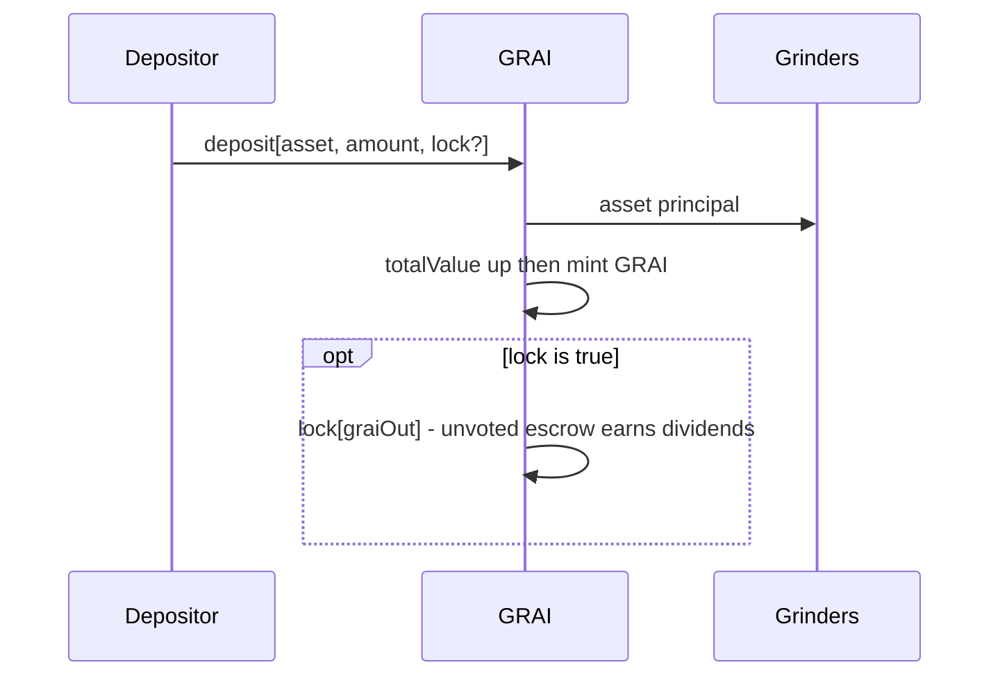
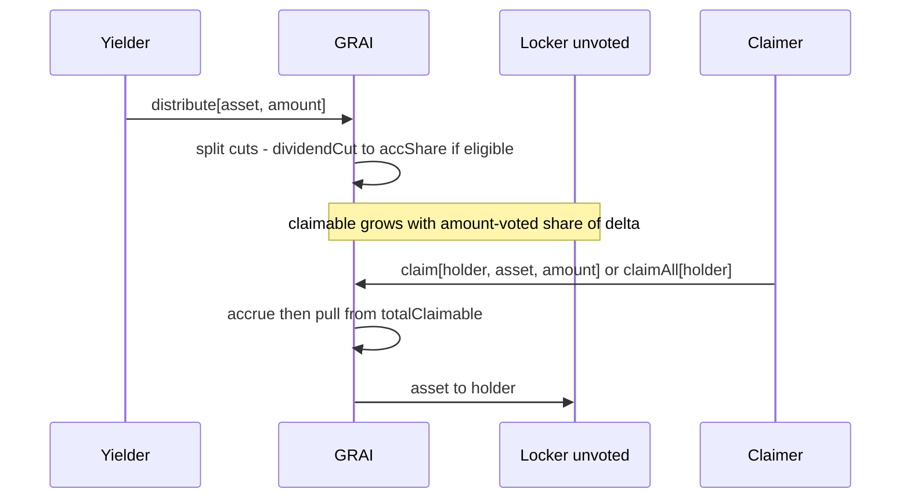
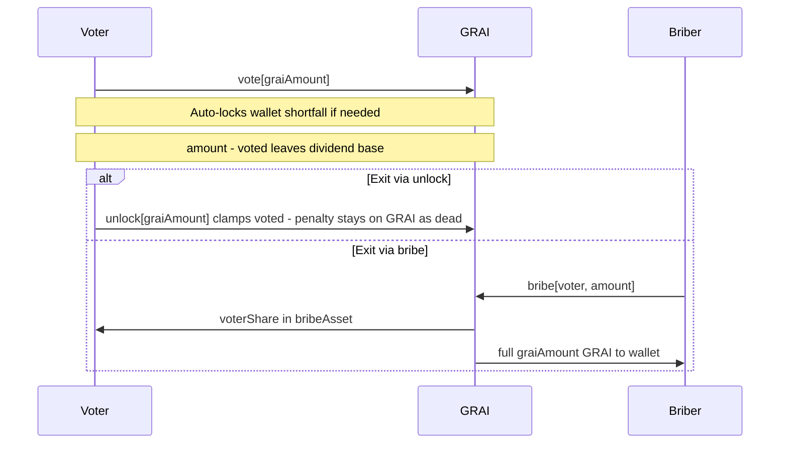
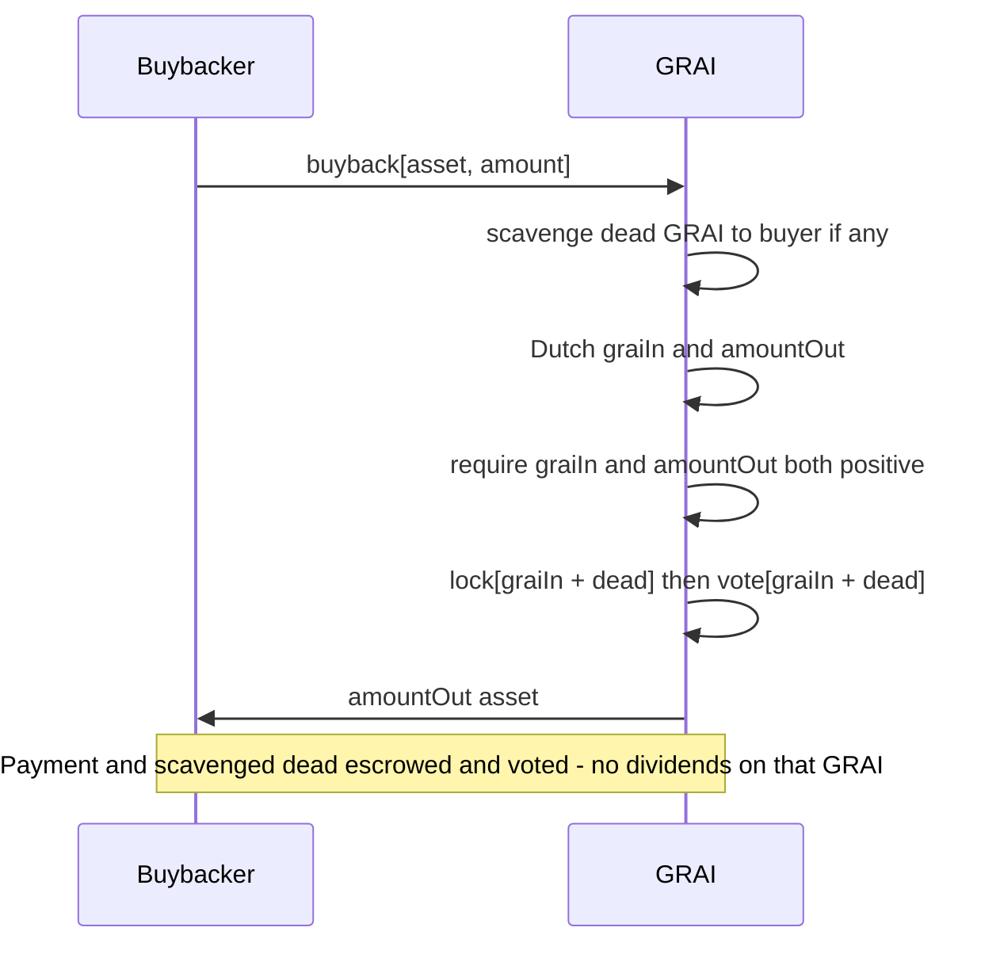
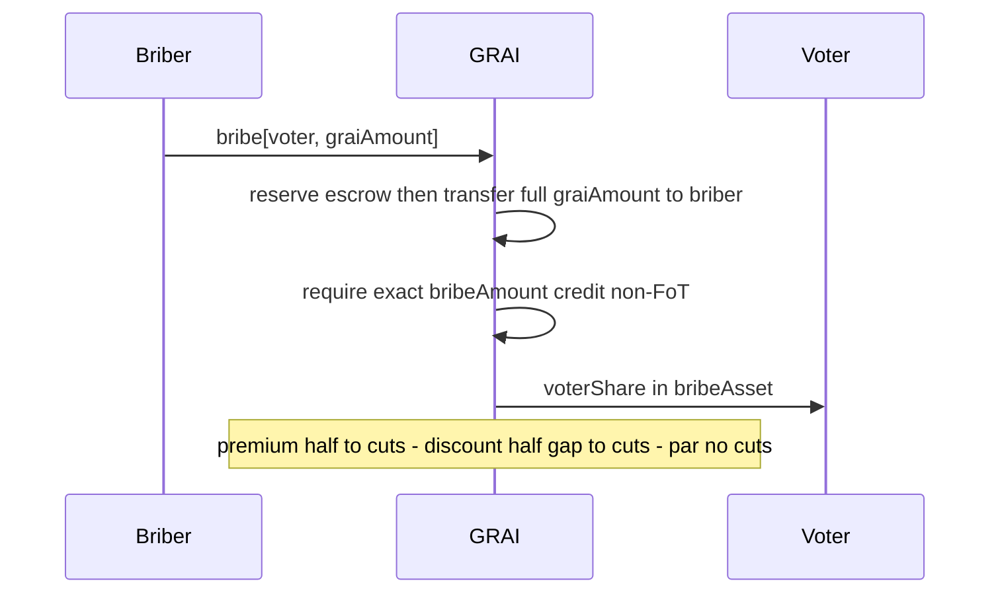
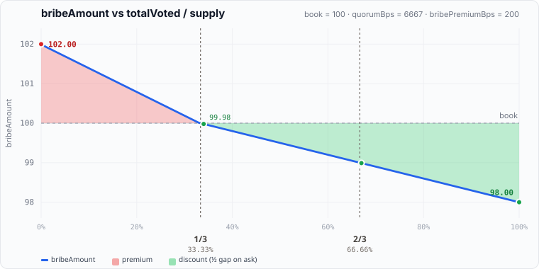

# GRAI Tokenomics — Protocol Overview

Report derived from on-chain logic in `[GRAI.sol](../src/GRAI.sol)`, `[Treasury.sol](../src/Treasury.sol)`, and `[Grinders.sol](../src/Grinders.sol)` (EVM implementation, July 2026). Integration happy path: `[test/GRAILifecycle.t.sol](../test/GRAILifecycle.t.sol)`. Affiliate / claim-time split: `[test/TreasuryReferrals.t.sol](../test/TreasuryReferrals.t.sol)`.

---

## 1. Executive summary

**GRAI** (*Grinders Artificial Index*) is a USD-denominated fund-share ERC20 (6 decimals). Depositors mint shares at **book value**. Capital sits in **Grinders**; custodian wallets (NFT-controlled) generate yield.

**Role ladder**

```
holder  →  lock()  →  locker (unvoted)  →  vote()  →  voter  ←  bribe()  ←  briber
              │              │               │
              │         earn dividends     no asset dividends
              │     (escrow.amount − voted)  quorum / bribe market
              │
         buyback() also lock()+vote() on the buyer
         (Dutch payment GRAI + scavenged dead → liquidation vote, not a free refill)
```

- **Dividends** accrue only on **unvoted** locked GRAI: `escrow.amount − escrow.voted` (index over `totalLocked − totalVoted`).
- **Vote** has an opportunity cost: voted GRAI leaves the dividend base.
- **No GRAI vote-reward index** — buyback payments are not redistributed to voters as GRAI rewards.
- A holder may `vote` without a prior `lock`: `vote` locks any wallet shortfall so `voted ≤ amount`.
- `**distribute()**` — permissionless yield in; splits per `Config` cuts (see table below). Same cut path used for bribe premium / discount carve-outs.
- `**bribe()**` — permissionless buyout of **voted** GRAI for `bribeAsset` at dynamic ask vs half-quorum.

**Exit paths (no open-market redeem while live)**

1. `unlock` — return locked GRAI to the wallet (clamps `voted ≤ amount`); early unlock penalty stays on GRAI as orphan/dead inventory (next `buyback` scavenges it via `balanceOf(this) − totalLocked`).
2. `bribe` — buy out **voted** GRAI for `bribeAsset` at a dynamic ask vs half-quorum (premium / par / discount).
3. **Secondary market** — sell free (unlocked) wallet GRAI OTC / CEX / DEX; protocol does not provide a live redeem.
4. **Liquidation** — **2-of-2**: vote quorum **and** owner confirmation (`confirmed` / owner `liquidate` with quorum) → holders `redeem` → anyone `resettle` (fund restarts). Voters alone cannot open; non-owner open needs prior `confirmed`.

**Yield (**`distribute`**) / bribe premium** splits per `Config` (initialize defaults **≈33.33% / 33.34% / 33.33%**):


| Cut      | Default                 | Destination                                                    |
| -------- | ----------------------- | -------------------------------------------------------------- |
| Buyback  | `buybackCutBps` 33.33%  | Dutch lot via `_place` (sold for GRAI via `buyback`)           |
| Dividend | `dividendCutBps` 33.34% | Unvoted lockers via `totalPositions[asset].accShare` → `claim` |
| Treasury | `treasuryCutBps` 33.33% | `treasury` (affiliates paid later on `claim`; see §10)             |


If there are **no unvoted locks** (`totalLocked == totalVoted`), or the cut is too small to move the index, the dividend cut is **merged into the auction** instead.

**`buyback`:** buyer pays **GRAI** (`graiIn`), receives the listed asset; any orphan/dead GRAI on the contract (`balanceOf(this) − totalLocked`) is credited to the buyer first, then `lock(graiIn + dead)` + `vote(graiIn + dead)` so the payment (and scavenged dead) is escrowed and voted on the buyer (exit via `bribe` or `unlock` + timelock penalty).

---


## 2. Actors and contracts


| Actor / contract       | Role                                                                                                  |
| ---------------------- | ----------------------------------------------------------------------------------------------------- |
| **Depositor / holder** | Mints GRAI at book; may `lock` in the same tx (`deposit(..., lock)`)                                  |
| **Locker (unvoted)**   | Escrows GRAI; earns **asset dividends** on `amount − voted`                                           |
| **Voter**              | `vote()` (auto-locks shortfall); quorum; **no** asset dividends on voted share; buyable via `bribe()` |
| **Buyback buyer**      | Pays GRAI Dutch ask; receives asset; payment auto lock+vote on buyer                                  |
| **Briber**             | Pays `bribeAsset` to buy out voted GRAI (receives full `graiAmount` to wallet)                        |
| **GRAI**               | Share token, oracles, auctions, lock/vote/bribe/liquidation, dividends                                |
| **Grinders**           | NFT registry, reserve custody, allocation, liquidation sweeps                                         |
| **Custodian**          | Per-NFT wallet; `distribute()` yield → GRAI                                                           |
| **Treasury**           | Yield / bribe fee sink; sticky referrer NFTs; claim-time affiliate + `beneficiar` split               |
| **Affiliate**          | Owns a depositor’s Treasury NFT; earns L1/L2 share of claim-time `revenueShare`                       |
| **Owner**              | Multisig + DAO (Ownable2Step): feeds, config, UUPS; liquidation consent via `confirmed` / `liquidate` |


Native ETH = `address(0)`. WETH is the fallback when ETH pushes are rejected.

`paused` on an asset gates `deposit` **only** (not buyback / distribute / claim). Listing `address(this)` as an asset is a no-op (escrowed GRAI must not enter the redeem basket). Listed collateral is assumed **non-rebasing** (balance only changes via GRAI `_pay` / `_withdraw`); rebasing tokens are out of scope.

---


## Actor playbooks


### Depositor / locker




| Step | Action                          | Effect                                                                                         |
| ---- | ------------------------------- | ---------------------------------------------------------------------------------------------- |
| 1    | `deposit(asset, amount, lock)`  | Asset → Grinders; mint at book; optional escrow                                                |
| 2    | Or later `lock(graiAmount)`     | Escrow wallet GRAI; dividend-eligible while unvoted; **resets** `lockedAt` on the whole escrow (fee is flat — reset does not change unlock cost) |
| 3    | Accrue / `claim(holder, asset)` | Receive yield-asset dividends (allowed in liquidation — reserve ≠ redeem basket)               |
| 4    | `unlock(graiAmount)` | Accrue, flat unlock fee stays on GRAI (dead), clamp votes, return net |
| 5    | Optional `vote`                 | See Voter — voted share stops earning dividends                                                |


Liquid wallet GRAI does **not** receive yield dividends.

**Example 1** (happy path — default config, USDC @ $1, empty vault → mint at par):

Alice deposits **100 USDC** (`deposit(USDC, 100e6, lock=true)`). Oracle marks them at $1 → `value = 100e6`. Empty vault (`totalValue == 0`) so mint is bootstrap:
`graiOut = value` → she receives **100 GRAI**, which are escrowed unvoted; she is dividend-eligible on the full 100.
(When the book is live: `graiOut = value * supply / totalValue`.)

**Example 2** (live book — same deposit into a non-empty vault):

- `totalValue = $1,234,567.80` (`1_234_567.8e6` book units)
- `supply = 1,000,000 GRAI` (`1_000_000e6`)
- Book price = `totalValue / supply ≈ $1.2345678` per GRAI

Alice again deposits **100 USDC** → `value = 100e6`:

```
graiOut = value * supply / totalValue
        = 100e6 * 1_000_000e6 / 1_234_567.8e6
        = 81_000_006   // integer division
        ≈ 81.000006 GRAI
```

She receives **≈81 GRAI** (not 100) because each share already marks above $1. Then `totalValue += 100e6`, `supply += graiOut`.

**Example 3** (deposit + lock — wallet vs escrow, dividend right):

Alice calls `deposit(USDC, 100e6, lock=true)` on an empty vault (mint as in Example 1: `graiOut = value` → **100 GRAI**):


| Where                      | Amount       | Notes                                                               |
| -------------------------- | ------------ | ------------------------------------------------------------------- |
| Alice wallet (`balanceOf`) | **0 GRAI**   | With `lock=true`, minted shares do not stay liquid                  |
| Alice escrow (`amount`)    | **100 GRAI** | Minted via `graiOut = value` (bootstrap); `voted = 0`               |
| Dividend eligibility       | **100**      | `amount − voted` — unvoted lock earns asset yield from `distribute` |


She may later `claim` / `claimAll` yield assets accrued to that escrow.

---


### Claimer

Anyone may call `claim` / `claimAll` for a **holder** who has accrued yield on **unvoted** locked GRAI (`escrow.amount − escrow.voted`). Dividends are paid in the **yield asset** (not GRAI). **Allowed while liquidation is open**: `claim` pays only from the `totalClaimable` reserve, which `_redeemable` excludes from redeem / `resettle` — the two pools do not mix. Unclaimed reserve also survives `resettle`. (`unlock` itself is still blocked in liquidation.)




| Step | Action                            | Effect                                                                               |
| ---- | --------------------------------- | ------------------------------------------------------------------------------------ |
| 1    | Eligible lock                     | Unvoted escrow earns; liquid wallet GRAI and voted share earn **nothing**            |
| 2    | `distribute`                      | `dividendCut` raises `accShare` (or merges into auction if no eligible locks / dust) |
| 3    | Accrue                            | Holder debt sync; `previewClaim` / `previewClaimAll` for UI                          |
| 4    | `claim(holder, asset, amount)`    | Pays up to accrued for one asset; anyone can call for `holder`                       |
| 5    | `claimAll(holder)`                | Same for every listed asset with a balance                                           |
| 6    | Separate `claim` / `claimAll`     | Dividends are **not** pulled inside `unlock`                                         |


**Example** (happy path — Alice 100 locked unvoted, Bob 100 locked unvoted; `dividendCut` = 30 USDC):

1. Eligible base = 200. Alice’s share = 100/200 → **15 USDC** accrued; Bob → **15 USDC**.
2. Alice (or a keeper) calls `claim(alice, USDC, type(uint256).max)` → Alice receives **15 USDC**; her claimable for USDC → 0. Bob still has **15 USDC** unclaimed.
3. Alice `vote`s 40 of 100 → only **60** of hers stays in the index; Bob still **100**. Eligible base = **160**.
4. Second `distribute` with another **30 USDC** dividend cut:
  - Alice: 60/160 × 30 = **11.25 USDC** accrued
  - Bob: 100/160 × 30 = **18.75 USDC** accrued (on top of his leftover 15 → **33.75** claimable if he never claimed)
5. `claim(alice, …)` → Alice gets **11.25 USDC**. `claim(bob, …)` → Bob gets **15 + 18.75 = 33.75 USDC**

---


### Voter

Any holder may `vote` directly. If `voted + graiAmount > amount`, `vote` first `lock`s the shortfall, then commits. Voted GRAI is excluded from the dividend index.




| Step | Action             | Effect                                                                                                          |
| ---- | ------------------ | --------------------------------------------------------------------------------------------------------------- |
| 1    | `vote(graiAmount)` | Auto-lock shortfall; `voted ≤ amount`; `totalVoted` ↑; dividend base ↓                                          |
| 2    | Quorum             | `totalVoted / supply > quorumBps` (strict) — necessary but not sufficient for open (needs owner limb)           |
| 3a   | `unlock`           | Excess votes clamped; net GRAI returned; unlock fee stays on GRAI as dead                                       |
| 3b   | `bribe`            | Full `graiAmount` sold for exact `bribeAmount` in `bribeAsset` (non-FoT)                                        |
| 3c   | `liquidate`        | Owner: toggle `confirmed` if no quorum, else open; non-owner: open iff `confirmed && hasQuorum()`               |


**Example** (Alice votes — escrow and dividend base):

Supply = **1,000 GRAI**. Alice already has **100 GRAI** locked unvoted (`amount = 100`, `voted = 0`, wallet = 0).

1. Alice calls `vote(40)`.
2. No wallet shortfall (`voted + 40 ≤ amount`) → no extra `lock`.
3. After the call:


| Field                                   | Before | After  |
| --------------------------------------- | ------ | ------ |
| `escrow.amount`                         | 100    | 100    |
| `escrow.voted`                          | 0      | **40** |
| Dividend eligibility (`amount − voted`) | 100    | **60** |
| `totalVoted`                            | 0      | **40** |
| `totalVoted / supply`                   | 0%     | **4%** |


1. Her **40** voted GRAI no longer earn asset dividends and can be bought out via `bribe`. The remaining **60** stay in the dividend index. Quorum (~66.67%) is not met yet.

---


### Buybacker




| Step | Action             | Effect                                                                                              |
| ---- | ------------------ | --------------------------------------------------------------------------------------------------- |
| 0    | Scavenge dead      | `balanceOf(this) − totalLocked` → buyer wallet (unlock fees, stray transfers)                       |
| 1    | Pay Dutch `graiIn` | `lock(graiIn + dead)` then `vote(graiIn + dead)` — payment not reused from prior unvoted lock       |
| 2    | Receive asset      | Possible discount vs mint ask (floor at `BPS − bribePremiumBps`)                                    |
| 3    | Exit payment       | `bribe` (refund in `bribeAsset`) or `unlock` (fee stays on GRAI as dead)                            |


Buyback payment is **not burned** — it is a lock+vote that the buyer may exit immediately. Same-tx self-`bribe` or `unlock` is fine: the economic cost of taking the lot is the unlock fee (stays on GRAI as dead → next scavenger) or bribe cutPool (~½ premium / discount carve-out), not permanent loss of `graiIn`. Atomic exit via ETH/callback reentrancy is the same product path, not a separate bug.

**Example 1** (Bob fills at mint ask — `t = 0`, default `bribePremiumBps = 2%`, period = 7d):

Open auction after yield: **2,000 USDC** remaining, mint ask `maxPayment = 2,000 GRAI`, floor `minPayment = 1,960 GRAI` (98% of maxPayment).

1. Bob calls `buyback(USDC, type(uint256).max)`:
  - Pays `graiIn = 2,000 GRAI`, receives **2,000 USDC**.
  - Protocol `lock(2000)` + `vote(2000)` on Bob.
2. Balances after fill:


| Where                         | Amount            | Notes                                             |
| ----------------------------- | ----------------- | ------------------------------------------------- |
| Bob wallet USDC               | **+2,000**        | Asset from the lot                                |
| Bob wallet GRAI               | **−2,000**        | Spent on the ask                                  |
| Bob escrow `amount` / `voted` | **2,000 / 2,000** | Payment locked **and** voted — no dividends on it |
| Auction                       | closed            | `remaining = 0`                                   |


1. Exit that payment later via `bribe` (refund in `bribeAsset`) or `unlock` (flat unlock fee stays on GRAI as dead).

**Example 2** (Bob fills at Dutch discount — after `buybackPeriod`):

Same lot: **2,000 USDC**, `maxPayment = 2,000`, `minPayment = 1,960`. Clock has fully decayed.

1. Bob calls `buyback(USDC, type(uint256).max)`:
  - Pays `graiIn = 1,960 GRAI` (floor = 98% of mint), receives **2,000 USDC**.
  - Effective price ≈ **$0.98** of book per USDC taken; **40 GRAI** saved vs Example 1.
  - Still `lock(1960)` + `vote(1960)` on Bob.
2. Escrow after fill: `amount = voted = 1,960` — same shape as Example 1, smaller vote weight.

**Example 3** (secondary market GRAI → auction fill → vote / bribe surface):

1. Bob buys **2,000 GRAI** on a secondary market (CEX / DEX / OTC) for cash — protocol is not involved; GRAI lands in his **wallet**.
2. He sees the same USDC Dutch lot at `t = 0` (`maxPayment = 2,000`) and calls `buyback(USDC, max)`.
3. Wallet **−2,000 GRAI**, wallet **+2,000 USDC**; escrow opens `amount = voted = 2,000`.
4. That escrow is a **vote position** toward liquidation quorum (`totalVoted` ↑ by 2,000) and pays **no** asset dividends on those 2,000.
5. Exit options for the vote:
  - someone `bribe`s Bob’s voted GRAI for `bribeAsset` at the dynamic ask; or
  - Bob `unlock`s (flat fee stays on GRAI as dead).

Net: secondary GRAI was the ticket into the auction; the fill automatically created a bribeable vote, not free liquid GRAI.

---


### Briber

Buys **voted** GRAI only (`graiAmount ≤ voted`). `bribeAsset` must **not** be fee-on-transfer: `_pay` must credit exactly `bribeAmount`, and the briber receives the **full** escrowed `graiAmount`.




| Step | Action         | Effect                                                                                      |
| ---- | -------------- | ------------------------------------------------------------------------------------------- |
| 1    | `previewBribe` | Book × (1 + dynamic adj); discount ask uses half gap                                        |
| 2    | `bribe`        | Escrow reserved; full `graiAmount` → briber wallet; exact `_pay` required (`AmountZero` else) |
| 3    | GRAI out       | Always the requested `graiAmount` (no FoT pro-rata / no leftover on voter)                  |
| 4    | Split          | Premium: ½ premium → cuts; discount: other ½ gap → cuts; par: all to voter                  |
| —    | Self-bribe     | Net cost ≈ half premium when scarce; under discount briber saves ½ gap, cuts take ½         |


To earn dividends after a bribe, the briber must `lock` the received GRAI (and leave it unvoted).

**Examples** (Brian bribes **Violett**’s **100 voted GRAI**; default config; `book = 100` bribeAsset; exact pay; Brian gets **100 GRAI**):

Setup: Violett locked and `vote`d **100 GRAI** (wallet = 0, escrow `amount = voted = 100`). She forgoes dividends on that share and waits for a briber. Brian buys her vote out.


| `totalVoted/supply` | Regime   | Brian pays | Violett (voter) receives | Cuts | Brian gets |
| ------------------- | -------- | ---------- | ------------------------ | ---- | ---------- |
| 15%                 | premium  | 101.09     | 100.55                   | 0.54 | 100 GRAI   |
| 60%                 | discount | 99.20      | 98.40                    | 0.80 | 100 GRAI   |
| 100%                | discount | 98.00      | 96.00                    | 2.00 | 100 GRAI   |


---


## 3. Value flows (high level)

```
                    ┌──────────────────────────────────────────┐
                    │                   GRAI                   │
                    │  totalValue (book)                       │
                    │  locks + votes + Dutch lots              │
                    │  dividends (unvoted lockers only)        │
                    │  totalClaimable reserve (excluded from   │
                    │    redeem / resettle basket)             │
                    └───────────┬──────────────────┬───────────┘
                                │                  ▲
                       transfer │                  │ distribute (yield)
                                ▼                  │
                    ┌───────────────────┐          │
                    │     Grinders      │          │ yield
                    │  reserve + NFTs   │          │ 
                    └─────────┬─────────┘          │
                              │ allocate()         │
                              ▼                    │
                    ┌───────────────────┐          │
                    │    Custodian      │──────────┘
                    └───────────────────┘
```

---


## 4. GRAI share mechanics


### 4.1 Deposit

```
value   = usdValue(asset, amount)
graiOut = totalValue > 0 ? value * supply / totalValue : value   // bootstrap when book is 0
totalValue += value
mint(depositor, graiOut)
if (lock) lock(graiOut)
```

- Assets go to **Grinders**.
- Bootstrap mint when `totalValue == 0` (typically empty supply); yield on GRAI is excluded from the mint rate.
Cancelled Dutch inventory at `liquidate` enters the redeem basket by design (still excluding `totalClaimable`).
- Reverts if unknown / paused / liquidation open / zero value or shares.
- FoT-safe on ERC20 pulls (`_pay` credited delta).
- `paused` blocks deposits only.


### 4.2 Book vs market

- **Book** = `totalValue / totalSupply`.
- **Liquidation basket** = pro-rata of `_redeemable` on GRAI after sweeps (excludes `totalClaimable`).
  Share denominator is `_redeemSupply` = `totalSupply − (balanceOf(this) − totalLocked)` so unlock-penalty /
  donated orphan GRAI does not dilute redeemers while buyback scavenge is blocked.
- New deposits dilute quorum until voters re-commit.
- After `resettle`, `totalValue` marks to leftover basket NAV only when that raises mint price (`totalNAV >= totalValue`); otherwise book `totalValue` is kept and liquidation still clears (underwater reopen allowed).

---


## 5. Yield: `distribute` → auction / dividend / treasury

```
received     = tokens pulled to GRAI
treasuryCut  = received * treasuryCutBps / BPS
dividendCut  = received * dividendCutBps / BPS
buybackCut   = received - treasuryCut - dividendCut
```

Initialize defaults: **≈33.33% auction / 33.34% dividend / 33.33% treasury** (must sum to `BPS`). Owner may retarget via `setConfig` while liquidation is closed.


| Cut      | When unvoted locks exist                              | When `totalLocked == totalVoted` (or index dust) |
| -------- | ----------------------------------------------------- | ------------------------------------------------ |
| Treasury | → `treasury`                                          | → `treasury`                                     |
| Dividend | → `totalPositions[asset].accShare` + `totalClaimable` | → `_place` (buyback lot)                         |
| Buyback  | → `_place`                                            | → `_place`                                       |


Custodian / caller yield credited in `positions[from][asset].yielded` (analytics).

### 5.1 Locker dividends (unvoted only)

```
eligible     = totalLocked - totalVoted
accShare    += dividendCut * 1e18 / eligible     // or _place if eligible == 0 / dust
totalClaimable += dividendCut                    // when index moves
claimable   += (amount - voted) * accShare / 1e18 - debt
```

- Only **unvoted** locked GRAI earns asset dividends.
- Fully voted escrow (`amount == voted`) earns **none** on new cuts.
- New lockers sync debt to the **current** index → they do **not** receive past cuts.
- `vote` accrues then shrinks the eligible base and resyncs debt.
- Claim: `claim` / `claimAll` / previews — **allowed while liquidation is open** (pays only the reserved slice; does not touch the redeem basket). On claim, GRAI also asks Treasury to pay affiliates / `beneficiar` (see §10).
- Reserved `totalClaimable` is excluded from redeem / resettle sweeps (`_redeemable = bal − totalClaimable`) and remains claimable during liquidation and after restart.

Example: Alice locks 100, votes 40 → eligible 60. Bob locks 100 unvoted → eligible 100. Total eligible 160. A 30 USDC dividend cut pays Alice **11.25**, Bob **18.75**.

---


## 6. Dutch auctions


### 6.1 Lots (`_place`)

One open lot per sold asset. Ask is **GRAI** at mint price. GRAI itself cannot be auctioned (`address(this)` rejected).

```
remaining  += amount
maxPayment = previewDeposit(asset, remaining).graiOut
minPayment = maxPayment * (BPS - bribePremiumBps) / BPS  // default 98% (−2% max discount)
startTime  = now                                  // every merge, including dust
period     = config.buybackPeriod                 // snapshotted; default 7d
```

**Business logic:** the protocol **wants frequent** `_place`**s**, including dust top-ups from small `distribute` / bribe cuts. Each merge **intentionally** restarts the Dutch clock at the live mint ask for the full remaining lot — there is no “preserve elapsed on dust” path. Buyers should treat a near-floor ask as unstable until they land the fill; sandwich / repeated dust resets are accepted auction dynamics, not a defect. Ask never decays below the floor (unless `bribePremiumBps = BPS`).

### 6.2 Pricing / fill

```
graiIn, amountOut = previewBuyback(asset, amount, timestamp)
// graiIn = dutchAsk * amountOut / initial
```

`buyback(asset, amount)`:

1. Scavenge orphan/dead GRAI on the contract (`balanceOf(this) − totalLocked`, e.g. unlock fees) → buyer wallet, then included in the following `lock`+`vote`.
2. Preview Dutch `graiIn` / `amountOut`; **revert** `AmountZero` **unless both** `> 0` (no free / zero fills — prevents chunked floor-drain of a lot for Σ `graiIn = 0`).
3. Reduce auction `remaining` (or delete lot).
4. `lock(graiIn + dead)` then `vote(graiIn + dead)`.
5. Withdraw `amountOut` asset to buyer.

Dust tails where `ask * amountOut < initial` (floor → `graiIn = 0`) stay in the auction until a large enough fill, a later `_place` merge, or liquidation redeem. Full-lot ask floors at `(BPS − bribePremiumBps)` of mint (default 98%).

Liquidation deletes open auctions into the redeem basket.

---


## 7. Settlement asset (`bribeAsset`)

Used for bribe settlement (dynamic ask). May be listed via `_place` when premium-regime cuts apply.

**Not** payment for yield `buyback` (buyers pay GRAI).

`bribeAsset` must **not** be fee-on-transfer: `bribe` requires exact `_pay` credit (`received == bribeAmount`) and releases the **full** escrowed `graiAmount`. Deposit / `distribute` remain FoT-safe via credited `_pay` deltas.

Switching requires a feed; open votes/auctions do not block. Setting `bribeAsset = address(this)` is a no-op.

---


## 8. Lock, vote, bribe


### 8.1 Lock / unlock

- `lock` — escrow GRAI; dividend eligibility on the unvoted portion; `lockedAt = now` **on every top-up** (including buyback / vote shortfall). `lockedAt` is informational / legacy; unlock fee no longer depends on it.
- `unlock(graiAmount)` — accrue dividends, **flat** unlock fee stays on GRAI as orphan/dead (`balanceOf(this) − totalLocked` for the next `buyback`), clamp `voted ≤ amount`, return net GRAI. Yield claims are separate (`claim` / `claimAll`).
- Unlock penalty: always `unlockPenaltyBps` (default **10%**) of `graiAmount` — no time decay (`penalty = graiAmount * unlockPenaltyBps / BPS`).
- While penalty > 0, unlocks must be ≥ `ceil(BPS / unlockPenaltyBps)` (e.g. 10 GRAI wei at 10%) — including full-escrow exit. Smaller bags cannot unlock until fee is 0 or the lock grows.
- Unlock reduces lock first; vote is clamped only if `voted > amount` afterward.


### 8.2 Vote

- Call `vote` from wallet — no prior `lock` required (shortfall auto-locked; account enters `lockers` via `lock`, `voters` when `voted` becomes non-zero).
- Ends with `voted ≤ amount`; increases `totalVoted`; shrinks dividend eligibility.
- Quorum: `totalVoted * BPS > supply * quorumBps` (strict `>`; exact `quorumBps` share is not enough; live supply by design).


### 8.3 Bribe

Blocked while liquidation is open.

Ask tracks **vote share vs half-quorum** (`halfBps = quorumBps / 2`) continuously. `bribePremiumBps` is the slope scale (`|adj| = bribePremiumBps` at 0 votes and at quorum):

```
voteBps = totalVoted * BPS / supply
span    = halfBps                                   // floors to 1 if half is 0

adjBps  = 0                                              if voteBps == halfBps
        = +bribePremiumBps * (halfBps - voteBps) / span  if voteBps < halfBps
        = −bribePremiumBps * (voteBps - halfBps) / span  if voteBps > halfBps
        // no clamp: past quorum |adj| can exceed bribePremiumBps (may hit BPS → fullAsk = 0)

book         = bribeAssetAmount(graiAmount * totalValue / supply)
fullAsk      = book * (BPS + adjBps) / BPS               // premium leg
           // or adj >= BPS ? 0 : book * (BPS - |adj|) / BPS   // discount leg
premium      = adjBps > 0 ? fullAsk - book : 0           // scarce votes → favor voting
fullDiscount = adjBps < 0 ? book - fullAsk : 0           // excess votes → full gap vs book
discount     = fullDiscount / 2                          // half gap carved to cuts in bribe()
bribeAmount  = adjBps >= 0 ? fullAsk : book - discount   // discount regime: only half off ask
received     = _pay(...)                                 // must equal bribeAmount (non-FoT)
// full graiAmount transferred to briber; no proportional leftover on voter
```

`previewBribe` returns `(bribeAmount, premium, discount)` for UI signals.

**Chart** — ask vs `totalVoted/supply` (default `quorumBps=6667`, `bribePremiumBps=200`, fixed `book=100`).



Half-quorum is `quorumBps/2 = 3333` bps (~33.33%): **32%** still a tiny premium (`100.07`), **34%** starts discount (`99.98`). Red band = premium (half → cuts); green band = discount (ask uses `fullGap/2`, other half → cuts). Discount slope is half the premium slope.

**Table** (+2% `totalVoted/supply`, Solidity integer path, `book=100`):


| totalVoted/supply | bribeAmount | premium | discount | regime   |
| ----------------- | ----------- | ------- | -------- | -------- |
| 0%                | 102.00      | 2.00    | 0.00     | premium  |
| 2%                | 101.87      | 1.87    | 0.00     | premium  |
| 4%                | 101.75      | 1.75    | 0.00     | premium  |
| 6%                | 101.63      | 1.63    | 0.00     | premium  |
| 8%                | 101.51      | 1.51    | 0.00     | premium  |
| 10%               | 101.39      | 1.39    | 0.00     | premium  |
| 12%               | 101.27      | 1.27    | 0.00     | premium  |
| 14%               | 101.15      | 1.15    | 0.00     | premium  |
| 16%               | 101.03      | 1.03    | 0.00     | premium  |
| 18%               | 100.91      | 0.91    | 0.00     | premium  |
| 20%               | 100.79      | 0.79    | 0.00     | premium  |
| 22%               | 100.67      | 0.67    | 0.00     | premium  |
| 24%               | 100.55      | 0.55    | 0.00     | premium  |
| 26%               | 100.43      | 0.43    | 0.00     | premium  |
| 28%               | 100.31      | 0.31    | 0.00     | premium  |
| 30%               | 100.19      | 0.19    | 0.00     | premium  |
| 32%               | 100.07      | 0.07    | 0.00     | premium  |
| 34%               | 99.98       | 0.00    | 0.02     | discount |
| 36%               | 99.92       | 0.00    | 0.08     | discount |
| 38%               | 99.86       | 0.00    | 0.14     | discount |
| 40%               | 99.80       | 0.00    | 0.20     | discount |
| 42%               | 99.74       | 0.00    | 0.26     | discount |
| 44%               | 99.68       | 0.00    | 0.32     | discount |
| 46%               | 99.62       | 0.00    | 0.38     | discount |
| 48%               | 99.56       | 0.00    | 0.44     | discount |
| 50%               | 99.50       | 0.00    | 0.50     | discount |
| 52%               | 99.44       | 0.00    | 0.56     | discount |
| 54%               | 99.38       | 0.00    | 0.62     | discount |
| 56%               | 99.32       | 0.00    | 0.68     | discount |
| 58%               | 99.26       | 0.00    | 0.74     | discount |
| 60%               | 99.20       | 0.00    | 0.80     | discount |
| 62%               | 99.14       | 0.00    | 0.86     | discount |
| 64%               | 99.08       | 0.00    | 0.92     | discount |
| 66%               | 99.02       | 0.00    | 0.98     | discount |
| 68%               | 98.96       | 0.00    | 1.04     | discount |
| 70%               | 98.90       | 0.00    | 1.10     | discount |
| 72%               | 98.84       | 0.00    | 1.16     | discount |
| 74%               | 98.78       | 0.00    | 1.22     | discount |
| 76%               | 98.72       | 0.00    | 1.28     | discount |
| 78%               | 98.66       | 0.00    | 1.34     | discount |
| 80%               | 98.60       | 0.00    | 1.40     | discount |
| 82%               | 98.54       | 0.00    | 1.46     | discount |
| 84%               | 98.48       | 0.00    | 1.52     | discount |
| 86%               | 98.42       | 0.00    | 1.58     | discount |
| 88%               | 98.36       | 0.00    | 1.64     | discount |
| 90%               | 98.30       | 0.00    | 1.70     | discount |
| 92%               | 98.24       | 0.00    | 1.76     | discount |
| 94%               | 98.18       | 0.00    | 1.82     | discount |
| 96%               | 98.12       | 0.00    | 1.88     | discount |
| 98%               | 98.06       | 0.00    | 1.94     | discount |
| 100%              | 98.00       | 0.00    | 2.00     | discount |


Split of `received`:

- **Premium (**`premium > 0`**):** voter gets book + ½ premium; remaining half → auction / dividend / treasury cuts.
- **Discount (**`discount > 0`**):** ask is book − ½ full gap; the other half (`discount`) → cuts; voter keeps the rest.
- **Par:** voter gets **all** `received` (no cuts).

**Examples** (default config, fixed `book = 100` bribeAsset, exact pay):


| `totalVoted/supply` | Regime   | Briber pays | Voter receives | Cuts |
| ------------------- | -------- | ----------- | -------------- | ---- |
| 15%                 | premium  | 101.09      | 100.55         | 0.54 |
| 60%                 | discount | 99.20       | 98.40          | 0.80 |


- **15%:** `adj = 109` → ask = book × 1.0109. Half of the 1.09 premium → cuts (`⌊1.09/2⌋ = 0.54`); voter keeps book + other half (`100.55`).
- **60%:** `adj = 160` → full gap 1.60; ask uses half (`99.20`). The other half (`0.80`) → cuts; voter keeps `98.40`.

Briber receives the full requested `graiAmount` GRAI to **wallet**. Voter escrow for that amount is fully closed (no leftover locked+voted remainder).

---


## 9. Liquidation cycle


### 9.1 Open (`liquidate`, **2-of-2**: quorum **and** owner confirmation)

Opening liquidation needs **both** limbs:

1. **Quorum** — `hasQuorum()`: `totalVoted * BPS > totalSupply * quorumBps` (strict `>`; default ~66.67% — exact equality fails). Voters alone cannot open.
2. **Owner confirmation** — `confirmed` (and/or an owner `liquidate` call while quorum holds).

Same entrypoint `liquidate()` for everyone:

| Caller | Behavior |
| ------ | -------- |
| **Owner**, no quorum | Toggle `confirmed` (arm / disarm for a later non-owner open). Does **not** open. |
| **Owner**, quorum met | This call **is** consent → open immediately (`confirmed` not required). |
| **Non-owner** | Open only if `confirmed && hasQuorum()`; else `LiquidationNotConfirmed` / `LiquidationQuorumNotMet`. |

Then: cancel auctions into basket; `liquidationAt = now`. Deposits (and other live paths) are blocked by the liquidation flag — per-asset `paused` is **not** rewritten.

While liquidation is open, `setConfig` **is fully blocked** (`LiquidationOpen`) so live `liquidationPeriod` / `redeemPeriod` clocks cannot be rewritten mid-cycle. Zero windows are rejected even when closed (`PeriodZero`).

### 9.2 Consolidation (`liquidationPeriod`, default 24h)

`redeem` blocked (`LiquidationDelay`). Keepers run `Grinders.liquidate` sweeps → balances on GRAI. Deposit / buyback / bribe / lock / unlock / vote blocked while liquidation is open. `claim` **/** `claimAll` **stay open** — they draw only from `totalClaimable`, which is excluded from the redeem basket.

### 9.3 Redeem

After delay: snapshot `previewRedeem` (frozen vector); burn wallet then escrow; `totalValue` book burn; pay that vector.
Pro-rata denominator is `_redeemSupply` (`totalSupply` minus orphan/dead on GRAI), matching asset payouts and the book cut.
`nonReentrant` — nested redeem via ETH/ERC777 callbacks must not skim later assets. Clamp vote before dividend debt sync when reducing escrow.

**Example** (Alice redeems after consolidation):

State when `redeem` opens (`liquidationPeriod` elapsed):


| Item                                                         | Amount                                   |
| ------------------------------------------------------------ | ---------------------------------------- |
| `totalSupply`                                                | **1,000 GRAI**                           |
| `totalValue` (book)                                          | **$1,000**                               |
| Alice wallet                                                 | **100 GRAI** (10% of supply); escrow = 0 |
| Redeem basket on GRAI (after sweeps, excl. `totalClaimable`) | **8,000 USDC** + **1 WETH**              |


1. Alice calls `previewRedeem(100)` → vector is **10%** of each redeemable asset: **800 USDC** + **0.1 WETH**.
2. She calls `redeem(100)`:
  - Burns **100 GRAI** from wallet (`supply` → 900).
  - Book burn: `totalValue -= 100` → **$900** (pro-rata of book, independent of basket marks).
  - Pays her the frozen vector: wallet **+800 USDC**, **+0.1 WETH**.
3. Remaining holders still share the leftover basket **7,200 USDC** + **0.9 WETH** against **900 GRAI** until they redeem or `resettle`.

Dividend `totalClaimable` is **not** in this vector — Alice (or anyone) may still `claim` that reserve during liquidation; it never enters the redeem pro-rata.

### 9.4 Close (`resettle`)

Permissionless after `liquidationPeriod + redeemPeriod`:

1. Sweep `_redeemable` → Grinders (dividend `totalClaimable` stays on GRAI).
2. Per-asset `paused` flags are left as the owner set them (liquidation itself never toggled them).
3. If `supply > 0`: if `totalNAV >= totalValue` then `totalValue = totalNAV`; else keep book `totalValue` (no revert — underwater reopen allowed).
4. If `supply == 0`: `totalValue = 0` even if dust was swept.
5. Clear `liquidation` / `liquidationAt`.

---


## 10. Treasury and affiliates

`[Treasury.sol](../src/Treasury.sol)` is the fee sink for `treasuryCutBps` (yield / bribe carve-outs) and the **sticky referrer NFT** layer. Affiliates do **not** cut the locker’s dividend payout — they are paid from Treasury inventory when the locker `claim`s.

### 10.1 Binding (deposit → NFT)

On first successful `deposit`, GRAI calls `treasury.mint(locker, referrer)` (try/catch — a missing treasury does not brick deposits):

- `tokenId = uint256(uint160(locker))` — one NFT per depositor, forever.
- NFT is minted to `referrer` (or to `locker` if `referrer == address(0)`).
- Sticky: remints revert `AlreadyBound`; transferring the NFT changes who receives future affiliate share.
- ERC-2981 royalty receiver is the **locker** (secondary sales of the claim NFT).

```
referrerOf(locker) = ownerOf(tokenId(locker))
```

### 10.2 Claim-time split

When yield lands, the full treasury cut is pushed to Treasury immediately. Affiliates are paid later, on `claim`, sized off the **claimed dividend**:

```
netProfitShare = claimed * treasuryCutBps / dividendCutBps   // full treasury slice attributed to this claim
revenueShare   = claimed * revenueShareBps / dividendCutBps   // affiliate pool (≤ treasury slice)
```

#### Derivation

Fix one `distribute` of yield `Y` (same cuts apply to bribe-premium carve-outs). By definition:

```
T = Y · treasuryCutBps  / BPS     // sent to Treasury now
D = Y · dividendCutBps  / BPS     // reserved for unvoted lockers
R = Y · revenueShareBps / BPS     // affiliate budget (config: R ≤ T)
```

Eliminate `Y` and `BPS`:

```
T / D = treasuryCutBps  / dividendCutBps
R / D = revenueShareBps / dividendCutBps
```

so `T = D · treasuryCutBps / dividendCutBps` and `R = D · revenueShareBps / dividendCutBps`.

A claim of size `claimed` is a share of that dividend pool. Under linear attribution (each unit of claimed dividend “carries” the same treasury / affiliate budget that funded it):

```
claimed / D = netProfitShare / T = revenueShare / R
```

Solve for the claim-time amounts:

```
netProfitShare = claimed · (T / D) = claimed · treasuryCutBps  / dividendCutBps
revenueShare   = claimed · (R / D) = claimed · revenueShareBps / dividendCutBps
```

**Conservation (full claims).** If lockers eventually claim the entire dividend cut (`Σ claimed = D`):

```
Σ netProfitShare = D · T / D = T
Σ revenueShare   = D · R / D = R
```

so claim-time withdrawals exactly exhaust the treasury income and the affiliate budget from that yield — no leftover identity gap (integer dust aside). Partial claims scale both sides by `claimed / D`; unpaid levels inside `revenueShare` stay with `beneficiar` via `netProfitShare − paid`.

**Why divide by `dividendCutBps`, not `BPS`.** `claimed` is denominated in the **dividend** slice, not in raw yield. Multiplying by `treasuryCutBps / BPS` would understate treasury attribution by `dividendCutBps / BPS` (e.g. with 20% treasury / 30% dividend, that would pay `0.2 · claimed` instead of `(20/30) · claimed`).

`treasury.distribute(asset, locker, netProfitShare, revenueShare)` then:

1. No-op if Treasury balance `< netProfitShare` (no partial affiliate pays).
2. Walks `revenueShareInfo(locker, revenueShare)` up to `revenueShareBps.length` levels (default **L1 80% / L2 20%**).
3. Stops on empty / self / cycle (`ref == 0 || ref == locker || ref == cur`).
4. Pays each present level; unpaid levels + remainder of `netProfitShare` → `beneficiar`.

Default GRAI `revenueShareBps = 3_33` (~3.33% of yield → affiliates).

### 10.3 Affiliate examples

Illustrative cuts **50 / 30 / 20** (buyback / dividend / treasury), `revenueShareBps = 1000` (10% of yield), Treasury L1/L2 **80 / 20**. Yield **100 USDC** → dividend **30**, treasury inventory **20**. Sole locker claims all **30**:

```
netProfitShare = 30 * 2000 / 3000 = 20
revenueShare   = 30 * 1000 / 3000 = 10
```


| Case | Chain | L1 | L2 | Beneficiar | Notes |
| ---- | ----- | -- | -- | ---------- | ----- |
| No referrer | — | 0 | 0 | **20** | Self-mint / unbound → empty `revenueShareInfo` |
| L1 only | Alice → Bob | **8** | 0 | **12** | Unpaid L2 (2) stays with protocol |
| L1 + L2 | Alice → Bob → Carol | **8** | **2** | **10** | Full affiliate pool paid |
| Cycle | Alice → Bob → Alice | **8** | 0 | **12** | Walk stops at L1 |
| Half claim (15) | Alice → Bob → Carol | **4** | **1** | **5** | Pro-rata; rest of inventory waits |
| `bal < netProfit` | any | 0 | 0 | 0 | Distribute no-op; claim tip/locker still pay |


Locker still receives `claimed − tip` in full; tip (`claimTipBps`, default 1%) goes to `msg.sender`.

Tests: `[test/TreasuryReferrals.t.sol](../test/TreasuryReferrals.t.sol)`.

---


## 11. Grinders layer

Full write-up: `[GRINDERS.md](GRINDERS.md)`.


| Topic              | Behavior                                                |
| ------------------ | ------------------------------------------------------- |
| Reserve            | Deposits land on Grinders                               |
| `allocate`         | Owner moves capital to custodian NFT wallets            |
| Custodian NFT      | `mint(kind, base, quote, owner)`; owner controls wallet |
| Yield              | Custodian trades → `distribute` → `GRAI.distribute`     |
| `deallocate`       | Custodian → Grinders reserve                            |
| Liquidation sweeps | Permissionless while GRAI liquidation open              |


---


## 12. Protocol configuration (defaults)


| Parameter             | Default         | Meaning                                                              |
| --------------------- | --------------- | -------------------------------------------------------------------- |
| `buybackCutBps`       | 33_33 (~33.33%) | Yield / bribe premium → Dutch lot                                    |
| `dividendCutBps`      | 33_34 (~33.34%) | → unvoted-locker dividends (or auction if none)                      |
| `treasuryCutBps`      | 33_33 (~33.33%) | → treasury                                                           |
| `revenueShareBps`     | 3_33 (~3.33%)   | Of yield → affiliates on claim (≤ `treasuryCutBps`)                  |
| `claimTipBps`         | 1_00 (1%)       | Slice of claimed dividend to `msg.sender`                            |
| `bribePremiumBps`     | 2_00 (2%)       | Bribe ask slope / Dutch buyback max discount                         |
| `quorumBps`           | 66_67 (66.67%)  | Strict: `voted/supply > quorumBps` to open liquidation               |
| `unlockPenaltyBps`    | 10_00 (10%)     | Flat unlock penalty (stays on GRAI as dead)                          |
| `buybackPeriod`       | 7 days          | Dutch GRAI ask → floor (`>= 7 days`)                                 |
| `liquidationPeriod`   | 24 hours        | Delay before `redeem` (must be `> 0`)                                |
| `redeemPeriod`        | 7 days          | Window before `resettle` (must be `> 0`)                             |


Cuts must sum to `BPS`. `setConfig` is **blocked entirely while liquidation is open**.

`buybackCutBps` / `dividendCutBps` / `treasuryCutBps` are set only at `initialize` and cannot be changed via `setConfig`. Tip, quorum, unlock fee, periods, and `REVENUE_SHARE` remain mutable via their dedicated ids.

Treasury defaults: L1/L2 `revenueShareBps = [8000, 2000]`, ERC-2981 `royaltyBps = 500`.

---


## 13. Access control


| Role                     | GRAI                                                                                                                                                                        |
| ------------------------ | --------------------------------------------------------------------------------------------------------------------------------------------------------------------------- |
| **Owner** (Ownable2Step) | UUPS, config (when not liquidating), grinders/treasury/bribeAsset, feeds, `set` / `setFeed` / `setAssetConfig`; liquidation 2-of-2 via `confirmed` / `liquidate` |


Grinders: `Ownable` for custodians / allocation / upgrades.

Treasury: `mint` / `distribute` = linked GRAI only; `setBeneficiar` / `setRoyaltyBps` / `setRevenueShareBps` / UUPS = `GRAI.owner()`.

---


## 14. Economic incentives


| Participant               | Incentive                                                                          |
| ------------------------- | ---------------------------------------------------------------------------------- |
| **Depositor**             | Book-priced GRAI                                                                   |
| **Unvoted locker**        | Asset dividends from yield / bribe premium                                         |
| **Affiliate**             | Tradable L1/L2 claim on `revenueShare` when the bound locker claims                |
| **Voter**                 | Path toward liquidation quorum; forgoes dividends on voted GRAI; exit via bribe/unlock |
| **Buyback buyer**         | Assets at Dutch discount; payment locked+voted; may scavenge unlock-fee dead GRAI  |
| **Briber**                | Acquire full voted GRAI for exact ask; ask/premium dynamic vs half-quorum          |
| **Grinders / custodians** | Trade allocated capital; `distribute` to protocol                                  |
| **Treasury / beneficiar** | Yield / bribe-premium cut; unpaid affiliate levels + protocol slice on claim       |


---


## 15. Key invariants

1. **Book** — `totalValue` moves on deposit, redeem burn, resettle NAV — not on yield/`buyback`.
2. **Dividends = unvoted lock** — index uses `totalLocked − totalVoted`; account base is `amount − voted`.
3. **Past dividends are not diluted** — new locks sync debt to the live index.
4. **No unvoted locks → dividend cut auctions** — same for bribe premium dividend cut.
5. `buyback` **pays GRAI** → scavenges dead if any → `lock` + `vote` on buyer (not a voter GRAI reward pool).
6. **Quorum uses live supply** — deposits dilute progress until re-votes.
7. **Liquidation is 2-of-2** — `hasQuorum()` **and** owner confirmation (`confirmed`, or owner `liquidate` while quorum holds).
8. **Liquidation basket ≠ book** — pro-rata of redeemable GRAI balances after sweeps; `totalClaimable` reserved.
9. **Bribe / mint / lock / unlock / vote blocked in liquidation**; `claim` **/** `claimAll` **allowed** — dividend reserve and redeemable basket are separate (`_redeemable`).
10. **FoT** — deposit/`distribute` size economics from credited `_pay`; `bribeAsset` is **non-FoT** (exact credit required; full `graiAmount` out).
11. `resettle` marks `totalValue = totalNAV` only when that raises mint price; otherwise keeps book TV (underwater reopen allowed). Deposit bootstrap when `totalValue == 0`.
12. `address(this)` **is never a listed / redeemable / bribe asset** — escrow stays escrow.
13. **Unlock penalty → dead GRAI** — flat `unlockPenaltyBps` (no time decay); penalty is not sent to treasury; next `buyback` may scavenge `balanceOf(this) − totalLocked` (locked+voted with the Dutch payment).
14. `buyback` **scavenges dead** before fill — orphan GRAI on the contract is credited to the buyer then lock+voted with `graiIn`.
15. **Affiliates ≠ locker cut** — claim tip / locker payout are independent of Treasury; affiliates pay from Treasury inventory sized by `revenueShareBps`.
16. **Treasury distribute is all-or-nothing** — `bal < netProfitShare` → no affiliate / beneficiar transfer for that claim.

---


## 16. Instruction reference


### GRAI


| Function                   | Caller                    | Liquidation open?                              |
| -------------------------- | ------------------------- | ---------------------------------------------- |
| `deposit(..., lock)`       | Anyone                    | Blocked                                        |
| `lock` / `unlock` / `vote` | Anyone                    | Blocked                                        |
| `distribute`               | Anyone (custodians)       | Blocked                                        |
| `buyback`                  | Anyone                    | Blocked                                        |
| `claim` / `claimAll`       | Anyone                    | Allowed (claims ≠ redeem basket)               |
| `bribe`                    | Anyone                    | Blocked                                        |
| `redeem`                   | Holder                    | Only when open (after delay); `nonReentrant`   |
| `liquidate`                | Owner / anyone            | 2-of-2: owner toggles `confirmed` or opens with quorum; non-owner opens iff `confirmed && hasQuorum()` |
| `resettle`                 | Anyone                    | Closes cycle; fund restarts                    |
| `setConfig`                | Owner                     | Blocked while open                             |


### Treasury


| Function                                      | Caller       | When                          |
| --------------------------------------------- | ------------ | ----------------------------- |
| `mint(locker, referrer)`                      | GRAI         | First deposit bind            |
| `distribute(asset, locker, net, revenue)`     | GRAI         | On `claim` (try/catch)        |
| `setBeneficiar` / `setRoyaltyBps` / `setRevenueShareBps` | GRAI owner | Anytime                       |


### Grinders


| Function                           | Caller    | When                  |
| ---------------------------------- | --------- | --------------------- |
| `allocate` / `mint` / `set`        | Owner     | Normal                |
| `deallocate`                       | Custodian | Normal                |
| `liquidate` / `liquidate(from,to)` | Anyone    | GRAI liquidation open |


---

