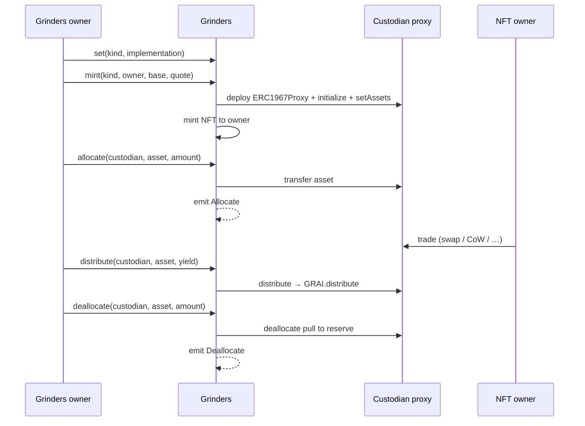

# Grinders

Report derived from on-chain logic in [`Grinders.sol`](../src/Grinders.sol), [`Custodian.sol`](../src/Custodian.sol), and custodian kinds under [`src/custodians/`](../src/custodians/) (EVM implementation, August 2026). GRAI share / dividend / auction mechanics: [`TOKENOMICS.md`](TOKENOMICS.md).

---

## 1. What Grinders is

**Grinders** is the protocol’s **junior-capital vault and custodian registry**:

| Piece | Role |
| ----- | ---- |
| **Reserve** | Holds deposited assets from `GRAI.deposit` (senior book stays on Grinders until allocated) |
| **ERC-721** | Collection **Grinders Custodians** (`GRINDERS`) — one NFT per registered custodian wallet |
| **Custodian proxies** | Per-NFT ERC-1967 wallets that trade `base` ↔ `quote` and return profit to GRAI |
| **Issuance trail** | `Allocate` / `Deallocate` events — off-chain net = Σ allocate − Σ deallocate (no on-chain ledger) |

GRAI mints shares against book; **working capital that earns yield lives in Grinders → custodian wallets**. Yield does **not** change `GRAI.totalValue` until it is reported through `GRAI.distribute` (auction / dividends / treasury).

```
Users ──deposit──► GRAI ──assets──► Grinders reserve
                                      │
                                      │ allocate (Grinders owner)
                                      ▼
                               Custodian NFT wallet
                                      │
                                      │ trade base ↔ quote (NFT owner)
                                      │
                    ┌─────────────────┴─────────────────┐
                    ▼                                   ▼
        distribute(yield) via Grinders          deallocate(principal) via Grinders
                    │                                   │
                    ▼                                   ▼
              GRAI cuts                           Grinders reserve
```

---

## 2. How income is generated

Grinders itself does **not** run a yield strategy. Income is produced by **custodian operators** (NFT owners) trading allocated inventory; the **Grinders protocol owner** then reports profit into GRAI or pulls capital back.

### 2.1 Capital path

1. Depositor calls `GRAI.deposit` → asset is paid to **Grinders** (`grinders`), book `totalValue` rises, shares mint.
2. Grinders **owner** calls `allocate(custodian, asset, amount)` → moves reserve inventory into a registered custodian wallet; emits `Allocate`.
3. Custodian NFT **owner** trades (kind-specific): swaps, CoW orders, LiFi routes, etc. Balances of `baseAsset` / `quoteAsset` (and optionally ETH) change on the wallet.
4. When booking **profit** for the protocol:
   - Grinders owner → `Grinders.distribute(custodian, asset, yieldAmount)` → `Custodian.distribute` → `GRAI.distribute` → cuts (unvoted dividends / treasury).
5. When returning **working capital** (not yield accounting):
   - Grinders owner → `Grinders.deallocate(custodian, asset, amount)` → `Custodian.deallocate` → assets back to the Grinders reserve; emits `Deallocate`.

There is **no on-chain “profit = balance − allocated” gate** and **no allocate ledger**. Custodians may swap principal between assets. `distribute` / `deallocate` are intentionally uncapped by prior allocates; misuse is a monitoring / governance concern. Track issuance with indexed events:

```text
event Allocate(address indexed custodian, address indexed asset, uint256 amount);
event Deallocate(address indexed custodian, address indexed asset, uint256 amount);
// net_issuance(custodian, asset) ≈ Σ Allocate.amount − Σ Deallocate.amount
```

Custodian also emits its own `Deallocate` / `Distribute` (asset + amount, no custodian index — the emitter address is the wallet).

### 2.2 Economic picture

| Flow | Meaning |
| ---- | ------- |
| Trade profit left on custodian, then Grinders `distribute` | Protocol yield → GRAI tokenomics |
| Inventory returned via Grinders `deallocate` | Capital back to reserve (may be a different token/size than allocated) |
| Idle reserve on Grinders | Not earning until `allocate`d |
| GRAI book (`totalValue`) | Unaffected by trades / distribute until deposit / redeem / revive |

Example (happy path):

1. Reserve holds **100,000 USDC** from deposits.
2. Owner `allocate`s **50,000 USDC** to a Swap custodian (`base=WETH`, `quote=USDC`).
3. Operator swaps into WETH / back to USDC over time; wallet ends with **52,000 USDC**.
4. Owner `distribute(custodian, USDC, 2,000)` → GRAI splits ~33/33/33 into auction, dividends, treasury.
5. Owner may `deallocate(custodian, USDC, 50,000)` (or any amount held) to refill the reserve.

---

## 3. Custodian kinds (how they trade)

Each kind is a UUPS implementation registered on Grinders under `keccak256("grindurus.custodian.<name>")`. `mint` deploys a fresh proxy; existing proxies keep their impl until the NFT owner upgrades.

| Kind string | Contract | How it earns |
| ----------- | -------- | ------------ |
| `grindurus.custodian.explicit_swap` | `SwapCustodian` | NFT owner builds router calldata; `swap(limitPrice, target, data)` enforces opposite base/quote deltas and a min/max execution price |
| `grindurus.custodian.cow` | `CoWCustodian` | CoW Protocol EIP-1271 orders; fills settle into the wallet |
| `grindurus.custodian.lifi` | `LiFiCustodian` | Stub / LiFi routing into the wallet (kind registered; routing TBD) |

Common base (`Custodian`):

- `baseAsset` / `quoteAsset` — `address` trading pair (set only via Grinders → `setAssets`, and only when both balances are zero).
- `nav()` — USD value of base+quote via GRAI oracles (ops / UI).
- `deallocate` / `distribute` — **only Grinders** (`msg.sender == grinders`); blocked while GRAI liquidation is open.
- `liquidate()` — only Grinders; sweeps ETH / base / quote to Grinders during protocol liquidation.
- NFT owner: trading APIs + `toggleUpgradeable` (UUPS lock / delayed re-enable).

`Custodian.distribute` try/catch: if `grai.distribute` fails, tokens are still forwarded raw to GRAI (or back to Grinders if `grai()` itself fails) and `Distribute` is emitted — funds are not left stranded on the wallet, but may bypass GRAI cut accounting.

Proceeds of trades **stay on the custodian** until Grinders owner calls `distribute` (yield) or `deallocate` (principal).

---

## 4. Grinders API (registry & reserve)

### 4.1 Lifecycle



| Function | Caller | Behavior |
| -------- | ------ | -------- |
| `set(kind, impl)` | Owner | Register / update default implementation for future `mint` (impl `custodianKind()` must match) |
| `setGrai(grai_)` | Owner | Retarget linked GRAI (do before `GRAI.setGrinders` when rewiring) |
| `mint(kind, owner_, base, quote)` | Owner | Deploy proxy, register id, mint NFT, `setAssets` |
| `register(custodian, owner_)` | Owner | Attach a pre-deployed proxy (must already point at this Grinders) |
| `setAssets(custodian, base, quote)` | Owner | Forward to custodian (balances of current pair must be zero) |
| `allocate(custodian, asset, amount)` | Owner | Reserve → custodian; requires `balance(asset) ≥ amount`; emits `Allocate` |
| `deallocate(custodian, asset, amount)` | Owner | Custodian → reserve via `Custodian.deallocate`; emits `Deallocate` |
| `distribute(custodian, asset, amount)` | Owner | Custodian → `GRAI.distribute` via `Custodian.distribute` |
| `liquidate(fromId, toId)` | Anyone | While `confirmed` **and** `grai.liquidation()` — see §6 |

### 4.2 Off-chain issuance accounting

There is **no** `allocated` / `totalAllocated` storage. Index Grinders logs:

| Event | Indexed | Use |
| ----- | ------- | --- |
| `Allocate(custodian, asset, amount)` | custodian, asset | Capital out of reserve |
| `Deallocate(custodian, asset, amount)` | custodian, asset | Capital back to reserve |

After swaps, returned token and size often differ from what was allocated — net by `(custodian, asset)` is informational, not an on-chain cap.

### 4.3 NFT / metadata

- Collection name: **Grinders Custodians**; symbol **GRINDERS**.
- `tokenURI(id)` — on-chain JSON via `GrinderArt` (custodian address + kind).
- `tokenURI()` (ERC-1046) — `https://grindurus.xyz/metadata.json`.
- NFT **owner** = custodian operator (`Custodian.owner()` reads `Grinders.ownerOf(id)`).
- Views: `getCustodiansData(fromId, toId)`, `custodianIdOf`, `custodianKindOf`, `isCustodian`.

---

## 5. Link to GRAI yield

When Grinders owner routes yield through `Custodian.distribute` → `GRAI.distribute(asset, amount)`:

```text
dividendCut  = received * dividendCutBps / BPS   // floor first
treasuryCut  = received - dividendCut            // remainder → treasury
```

Defaults **50% / 50%** → unvoted-locker dividends / treasury. Full cut rules and claims: [`GRAI.md`](GRAI.md) §5.

Analytics: `positions[msg.sender][asset].yielded` on GRAI accumulates credited distribute amounts (per caller — here the custodian wallet).

---

## 6. Liquidation

While `confirmed` **and** `grai.liquidation()` (after `GRAI.liquidate` opens the fund cycle):

1. Keepers call `Grinders.liquidate(fromId, toId)` with `fromId < toId` to page custodian ids, pull each wallet’s ETH / base / quote onto Grinders, then forward those amounts to GRAI.
2. **Idle sweep:** if `fromId >= toId`, the call treats the range as a sentinel (`type(uint256).max`) and forwards Grinders’ **own** balances of assets from `grai.getAssets()` to GRAI (no custodian pulls).
3. While `grai.liquidation()` is true, custodian `distribute` / `deallocate` revert (`LiquidationOpen`).
4. Holders `GRAI.redeem` from the redeemable basket; later `revive` can return leftovers to Grinders.

Grinders arms the Grinders-owner limb of GRAI’s 2-of-2 (`confirm` → `confirmed`). Anyone opens with `GRAI.liquidate` when `hasQuorum()`; GRAI flips to `REDEMPTION` before nested sweeps. Each `Grinders.liquidate` requires `confirmed` **and** `grai.liquidation()` (arm alone cannot sweep while still `GRINDING`). Arm stays through open for keeper sweeps; GRAI clears on `revive`.

---

## 7. Access control

| Role | Powers |
| ---- | ------ |
| **Grinders owner** | UUPS upgrade, `set` / `setGrai` / `mint` / `register` / `setAssets` / `allocate` / `deallocate` / `distribute` / `confirm` |
| **NFT owner (Grinder)** | Custodian trades (swap / CoW / …), `toggleUpgradeable` (custodian UUPS) |
| **Anyone** | `liquidate(fromId, toId)` when `confirmed` **and** `grai.liquidation()` |

Wire-up: after deploy, `GRAI.setGrinders(grinders)` requires `grinders.grai() == GRAI`.

---

## 8. Invariants / design notes

1. **Reserve ≠ strategy** — Grinders holds idle capital; earnings happen only in custodians.
2. **Yield is explicit** — profit enters protocol accounting only via `GRAI.distribute`, not by balance drift on Grinders.
3. **No allocate ledger** — do not expect on-chain `allocated`; use `Allocate` / `Deallocate` events.
4. **Trust model** — NFT owners trade; Grinders owner moves capital and reports yield. Mis-`distribute` of principal is a governance/monitoring concern, not an on-chain profit oracle.
5. **Listed assets** — idle liquidation sweeps follow `grai.getAssets()`; custodian pulls only auto-sweep ETH + their base/quote in `Custodian.liquidate`.
6. **Non-rebasing** listed collateral assumed (same as GRAI tokenomics).

---

## 9. Instruction reference

| Function | Caller | When |
| -------- | ------ | ---- |
| `set` / `setGrai` / `mint` / `register` / `setAssets` / `allocate` / `deallocate` / `distribute` | Grinders owner | Anytime (normal ops); deallocate/distribute blocked on custodian if GRAI liquidating |
| `confirm` | Grinders owner | Toggle arm for GRAI open / sweeps |
| Custodian trade APIs / `toggleUpgradeable` | NFT owner | Kind-specific |
| `liquidate(fromId, toId)` | Anyone | `confirmed` **and** `grai.liquidation()` (`fromId < toId` = page wallets; else idle reserve sweep) |
| `revive` | GRAI only | Called on `GRAI.revive`; clears `confirmed` |

---
