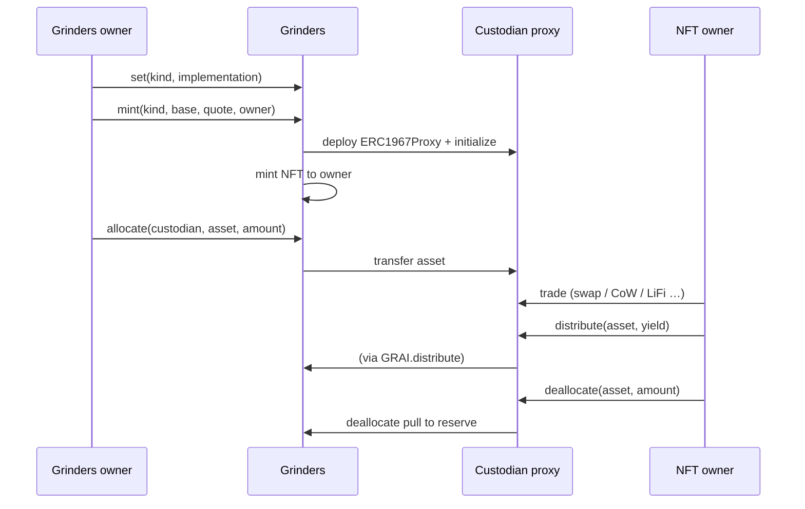

# Grinders

Report derived from on-chain logic in [`Grinders.sol`](../src/Grinders.sol), [`Custodian.sol`](../src/Custodian.sol), and custodian kinds under [`src/custodians/`](../src/custodians/) (EVM implementation, July 2026). GRAI share / dividend / auction mechanics: [`TOKENOMICS.md`](TOKENOMICS.md).

---

## 1. What Grinders is

**Grinders** is the protocol’s **junior-capital vault and custodian registry**:

| Piece | Role |
| ----- | ---- |
| **Reserve** | Holds deposited assets from `GRAI.deposit` (senior book stays on Grinders until allocated) |
| **ERC-721** | Collection **Grinders Custodians** (`GRINDERS`) — one NFT per registered custodian wallet |
| **Custodian proxies** | Per-NFT ERC-1967 wallets that trade `base` ↔ `quote` and return profit to GRAI |
| **Issuance ledger** | `allocated[custodian][asset]` — how much was sent via `allocate` (accounting only, not a pull cap) |

GRAI mints shares against book; **working capital that earns yield lives in Grinders → custodian wallets**. Yield does **not** change `GRAI.totalValue` until it is reported through `GRAI.distribute` (auction / dividends / treasury).

```
Users ──deposit──► GRAI ──assets──► Grinders reserve
                                      │
                                      │ allocate (owner)
                                      ▼
                               Custodian NFT wallet
                                      │
                                      │ trade base ↔ quote
                                      │
                    ┌─────────────────┴─────────────────┐
                    ▼                                   ▼
             distribute(yield)                    deallocate(principal)
                    │                                   │
                    ▼                                   ▼
              GRAI cuts                           Grinders reserve
```

---

## 2. How income is generated

Grinders itself does **not** run a yield strategy. Income is produced by **custodian operators** (NFT owners) trading allocated inventory, then **declaring** profit into GRAI.

### 2.1 Capital path

1. Depositor calls `GRAI.deposit` → asset is paid to **Grinders** (`grinders`), book `totalValue` rises, shares mint.
2. Grinders **owner** calls `allocate(custodian, asset, amount)` → moves reserve inventory into a registered custodian wallet; `allocated` / `totalAllocated` increase.
3. Custodian NFT **owner** trades (kind-specific): swaps, CoW orders, LiFi routes, etc. Balances of `baseAsset` / `quoteAsset` (and optionally ETH) change on the wallet.
4. When the operator wants to book **profit** for the protocol:
   - `Custodian.distribute(asset, yieldAmount)` → `GRAI.distribute` → cuts (Dutch auction / unvoted dividends / treasury).
5. When returning **working capital** (not yield accounting):
   - `Custodian.deallocate(asset, amount)` → `Grinders.deallocate` → assets back to the Grinders reserve; ledger floored toward zero for that asset.

There is **no on-chain “profit = balance − allocated” gate**. Custodians may swap principal between assets, so a reliable residual check is hard. `distribute` is intentionally uncapped by `allocated`; misuse is observable via the public ledger and `positions[from][asset].yielded` on GRAI (ops / governance response).

### 2.2 Economic picture

| Flow | Meaning |
| ---- | ------- |
| Trade profit left on custodian, then `distribute` | Protocol yield → GRAI tokenomics |
| Inventory returned via `deallocate` | Capital back to reserve (may be a different token/size than allocated) |
| Idle reserve on Grinders | Not earning until `allocate`d |
| GRAI book (`totalValue`) | Unaffected by trades / distribute until deposit / redeem / resettle |

Example (happy path):

1. Reserve holds **100,000 USDC** from deposits.
2. Owner `allocate`s **50,000 USDC** to a Swap custodian (`base=WETH`, `quote=USDC`).
3. Operator swaps into WETH / back to USDC over time; wallet ends with **52,000 USDC**.
4. Operator `distribute(USDC, 2,000)` → GRAI splits ~33/33/33 into auction, dividends, treasury.
5. Operator may `deallocate(USDC, 50,000)` (or any amount held) to refill the reserve.

---

## 3. Custodian kinds (how they trade)

Each kind is a UUPS implementation registered on Grinders under `keccak256("grindurus.custodian.<name>")`. `mint` deploys a fresh proxy; existing proxies keep their impl until the NFT owner upgrades.

| Kind string | Contract | How it earns |
| ----------- | -------- | ------------ |
| `grindurus.custodian.explicit_swap` | `SwapCustodian` | NFT owner builds router calldata; `swap(limitPrice, target, data)` enforces opposite base/quote deltas and a min/max execution price |
| `grindurus.custodian.cow` | `CoWCustodian` | CoW Protocol EIP-1271 orders; fills settle into the wallet |
| `grindurus.custodian.lifi` | `LiFiCustodian` | LiFi routing into the wallet |

Common base (`Custodian`):

- `baseAsset` / `quoteAsset` trading pair (owner may `setAssets` only when both balances are zero).
- `nav()` — USD value of base+quote via GRAI oracles (ops / UI).
- `distribute` / `deallocate` — only NFT owner; blocked while GRAI liquidation is open.
- `liquidate()` — only Grinders; sweeps ETH / base / quote to Grinders during protocol liquidation.

Proceeds of trades **stay on the custodian** until the owner calls `distribute` (yield) or `deallocate` (principal).

---

## 4. Grinders API (registry & reserve)

### 4.1 Lifecycle



| Function | Caller | Behavior |
| -------- | ------ | -------- |
| `set(kind, impl)` | Owner | Register / update default implementation for future `mint` |
| `mint(kind, base, quote, owner)` | Owner | Deploy proxy, register id, mint NFT |
| `register(custodian, owner)` | Owner | Attach a pre-deployed proxy (must already point at this Grinders) |
| `allocate(custodian, asset, amount)` | Owner | Reserve → custodian; requires `balance(asset) ≥ amount` |
| `deallocate(asset, amount)` | Custodian | Custodian → reserve; **not** capped by `allocated` |
| `liquidate()` | Anyone | While GRAI liquidation open: forward **idle** listed assets on Grinders to GRAI |
| `liquidate(fromId, toId)` | Anyone | Page custodians; each `Custodian.liquidate()` then forward swept ETH/base/quote to GRAI; clear allocation ledger for listed assets |

### 4.2 Allocation ledger

```text
allocated[custodian][asset]  += amount   // on allocate
allocated[custodian][asset]   = max(0, prev - amount)  // on deallocate (floor)
totalAllocated[asset]         // sum across custodians (same floor rules)
```

- **Not** an escrow balance and **not** a cap on `deallocate` / `distribute`.
- After swaps, returned token and size often differ from what was allocated.
- On ranged liquidation, ledger entries for listed assets on that custodian are cleared.

### 4.3 NFT / metadata

- Collection name: **Grinders Custodians**; symbol **GRINDERS**.
- `tokenURI(id)` — on-chain JSON via `GrinderArt` (custodian address + kind).
- `tokenURI()` (ERC-1046) — `https://grindurus.xyz/metadata.json`.
- NFT **owner** = custodian operator (`Custodian.owner()` reads `Grinders.ownerOf(id)`).

---

## 5. Link to GRAI yield

When a custodian (or any payer) calls `GRAI.distribute(asset, amount)`:

```text
treasuryCut  = received * treasuryCutBps / BPS
dividendCut  = received * dividendCutBps / BPS
buybackCut   = received - treasuryCut - dividendCut
```

Defaults ≈ **33.33% / 33.34% / 33.33%** → Dutch buyback lot / unvoted-locker dividends / treasury. Full cut rules, auctions, and claims: [`TOKENOMICS.md`](TOKENOMICS.md) §5.

Analytics: `positions[msg.sender][asset].yielded` accumulates credited distribute amounts (per caller).

---

## 6. Liquidation

While `grai.liquidation()` is true:

1. Keepers call `Grinders.liquidate(fromId, toId)` to pull custodian inventories onto Grinders, then to GRAI.
2. `Grinders.liquidate()` (no range) sweeps **idle** Grinders balances of listed assets to GRAI.
3. Custodian `distribute` / `deallocate` revert (`LiquidationOpen`).
4. Holders `GRAI.redeem` from the redeemable basket; later `resettle` can return leftovers to Grinders.

Grinders does not open liquidation — that is GRAI’s 2-of-2 (`hasQuorum` ∧ owner `liquidate`).

---

## 7. Access control

| Role | Powers |
| ---- | ------ |
| **Grinders owner** | UUPS upgrade, `set` / `mint` / `register` / `allocate` |
| **NFT owner (Grinder)** | Custodian trades, `distribute`, `deallocate`, custodian UUPS (unless disabled) |
| **Anyone** | `liquidate` / `liquidate(from,to)` when GRAI liquidation is open |

Wire-up: after deploy, `GRAI.setGrinders(grinders)` requires `grinders.grai() == GRAI`.

---

## 8. Invariants / design notes

1. **Reserve ≠ strategy** — Grinders holds idle capital; earnings happen only in custodians.
2. **Yield is explicit** — profit enters protocol accounting only via `GRAI.distribute`, not by balance drift on Grinders.
3. **Allocate ledger ≠ wallet** — do not treat `allocated` as spendable balance or deallocate limit.
4. **Trust model** — NFT owners are operators; mis-`distribute` of principal is a governance/monitoring concern, not an on-chain profit oracle.
5. **Listed assets** — liquidation sweeps follow `grai.getAssets()`; custodians still only auto-sweep ETH + their base/quote in `Custodian.liquidate`.
6. **Non-rebasing** listed collateral assumed (same as GRAI tokenomics).

---

## 9. Instruction reference


| Function | Caller | When |
| -------- | ------ | ---- |
| `set` / `mint` / `register` / `allocate` | Grinders owner | Anytime (normal ops) |
| `deallocate` | Registered custodian | Not during GRAI liquidation |
| `Custodian.distribute` | NFT owner | Not during GRAI liquidation |
| `Custodian` trade APIs | NFT owner | Kind-specific |
| `liquidate` / `liquidate(from,to)` | Anyone | `grai.liquidation() == true` |

---
