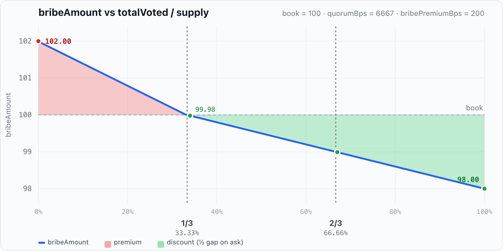

# GRAI Tokenomics — Protocol Overview

Report derived from on-chain logic in `[GRAI.sol](../src/GRAI.sol)` and `[Grinders.sol](../src/Grinders.sol)` (EVM implementation, July 2026).

---

## 1. Executive summary

**GRAI** (*Grinders Artificial Index*) is a USD-denominated fund-share ERC20 (6 decimals). Depositors mint shares at **book value**. Capital sits in **Grinders**; custodian wallets (NFT-controlled) generate yield.

**Role ladder**

```
holder  →  lock()  →  locker (unvoted)  →  vote()  →  voter  ←  bribe()  ←  briber
              │              │               │
              │         earn dividends     no asset dividends
              │     (escrow.amount − voted)  quorum / bribe market
              │
         buyback() also lock()+vote() on the buyer
         (Dutch payment GRAI → liquidation vote, not a free refill)
```

- **Dividends** accrue only on **unvoted** locked GRAI: `escrow.amount − escrow.voted` (index over `totalLocked − totalVoted`).
- **Vote** has an opportunity cost: voted GRAI leaves the dividend base.
- **No GRAI vote-reward index** — buyback payments are not redistributed to voters as GRAI rewards.
- A holder may `vote` without a prior `lock`: `vote` locks any wallet shortfall so `voted ≤ amount`.
- `**distribute()**` — permissionless yield in; splits per `Config` cuts (see table below). Same cut path used for bribe premium / discount carve-outs.
- `**bribe()**` — permissionless buyout of **voted** GRAI for `bribeAsset` at dynamic ask vs half-quorum.

**Exit paths (no open-market redeem while live)**

1. `unlock` — return locked GRAI to the wallet (clamps `voted ≤ amount`); early unlock penalty → **treasury**.
2. `bribe` — buy out **voted** GRAI for `bribeAsset` at a dynamic ask vs half-quorum (premium / par / discount).
3. **Secondary market** — sell free (unlocked) wallet GRAI OTC / CEX / DEX; protocol does not provide a live redeem.
4. **Liquidation** — quorum → owner `liquidate` → holders `redeem` → anyone `resettle` (fund restarts).

**Yield (**`distribute`**) / bribe premium** splits per `Config` (initialize defaults **≈33.33% / 33.34% / 33.33%**):


| Cut      | Default                 | Destination                                                    |
| -------- | ----------------------- | -------------------------------------------------------------- |
| Buyback  | `buybackCutBps` 33.33%  | Dutch lot via `_place` (sold for GRAI via `buyback`)           |
| Dividend | `dividendCutBps` 33.34% | Unvoted lockers via `totalPositions[asset].accShare` → `claim` |
| Treasury | `treasuryCutBps` 33.33% | `treasury`                                                     |


If there are **no unvoted locks** (`totalLocked == totalVoted`), or the cut is too small to move the index, the dividend cut is **merged into the auction** instead.

`buyback`**:** buyer pays **GRAI** (`graiIn`), receives the listed asset; then `lock(graiIn)` + `vote(graiIn)` so the payment is escrowed and voted on the buyer (exit via `bribe` or `unlock` + timelock penalty).

---

## 2. Actors and contracts


| Actor / contract       | Role                                                                                                  |
| ---------------------- | ----------------------------------------------------------------------------------------------------- |
| **Depositor / holder** | Mints GRAI at book; may `lock` in the same tx (`deposit(..., lock)`)                                  |
| **Locker (unvoted)**   | Escrows GRAI; earns **asset dividends** on `amount − voted`                                           |
| **Voter**              | `vote()` (auto-locks shortfall); quorum; **no** asset dividends on voted share; buyable via `bribe()` |
| **Buyback buyer**      | Pays GRAI Dutch ask; receives asset; payment auto lock+vote on buyer                                  |
| **Briber**             | Pays `bribeAsset` to buy out voted GRAI (receives proportional GRAI to wallet)                        |
| **GRAI**               | Share token, oracles, auctions, lock/vote/bribe/liquidation, dividends                                |
| **Grinders**           | NFT registry, reserve custody, allocation, liquidation sweeps                                         |
| **Custodian**          | Per-NFT wallet; `distribute()` yield → GRAI                                                           |
| **Treasury**           | Treasury cuts + unlock penalties                                                                      |
| **Owner**              | Multisig + DAO (Ownable2Step): feeds, config, `liquidate`, UUPS                                       |


Native ETH = `address(0)`. WETH is the fallback when ETH pushes are rejected.

`paused` on an asset gates `deposit` **only** (not buyback / distribute / claim). Listing `address(this)` as an asset is a no-op (escrowed GRAI must not enter the redeem basket).

---

## Actor playbooks

### Depositor / locker

```mermaid
sequenceDiagram
    participant D as Depositor
    participant G as GRAI
    participant R as Grinders

    D->>G: deposit(asset, amount, lock?)
    G->>R: asset (principal)
    G->>G: totalValue += usdValue; mint GRAI
    opt lock == true
        G->>G: lock(graiOut) — unvoted escrow earns dividends
    end
```


| Step | Action                          | Effect                                                                                         |
| ---- | ------------------------------- | ---------------------------------------------------------------------------------------------- |
| 1    | `deposit(asset, amount, lock)`  | Asset → Grinders; mint at book; optional escrow                                                |
| 2    | Or later `lock(graiAmount)`     | Escrow wallet GRAI; dividend-eligible while unvoted; **resets** `lockedAt` on the whole escrow |
| 3    | Accrue / `claim(holder, asset)` | Receive yield-asset dividends (blocked in liquidation)                                         |
| 4    | `unlock(graiAmount, claimAll_)` | Accrue, penalty → treasury, clamp votes, return net; optional claim all                        |
| 5    | Optional `vote`                 | See Voter — voted share stops earning dividends                                                |


Liquid wallet GRAI does **not** receive yield dividends.

**Example 1** (happy path — default config, USDC @ $1, empty vault → mint at par):

Alice deposits **100 USDC** (`deposit(USDC, 100e6, lock=true)`). Oracle marks them at $1 → `value = 100e6`. Empty vault (`totalValue == 0`) so mint is bootstrap:
`graiOut = value` → she receives **100 GRAI**, which are escrowed unvoted; she is dividend-eligible on the full 100.
(When the book is live: `graiOut = value * supply / totalValue`.)

**Example 2** (live book — same deposit into a non-empty vault):

- `totalValue = $1,234,567.80` (`1_234_567.8e6` book units)
- `supply = 1,000,000 GRAI` (`1_000_000e6`)
- Book price = `totalValue / supply ≈ $1.2345678` per GRAI

Alice again deposits **100 USDC** → `value = 100e6`:

```
graiOut = value * supply / totalValue
        = 100e6 * 1_000_000e6 / 1_234_567.8e6
        = 81_000_006   // integer division
        ≈ 81.000006 GRAI
```

She receives **≈81 GRAI** (not 100) because each share already marks above $1. Then `totalValue += 100e6`, `supply += graiOut`.

**Example 3** (deposit + lock — wallet vs escrow, dividend right):

Alice calls `deposit(USDC, 100e6, lock=true)` on an empty vault (mint as in Example 1: `graiOut = value` → **100 GRAI**):

| Where | Amount | Notes |
| ----- | -----: | ----- |
| Alice wallet (`balanceOf`) | **0 GRAI** | With `lock=true`, minted shares do not stay liquid |
| Alice escrow (`amount`) | **100 GRAI** | Minted via `graiOut = value` (bootstrap); `voted = 0` |
| Dividend eligibility | **100** | `amount − voted` — unvoted lock earns asset yield from `distribute` |

She may later `claim` / `claimAll` yield assets accrued to that escrow.

---

### Claimer

Anyone may call `claim` / `claimAll` for a **holder** who has accrued yield on **unvoted** locked GRAI (`escrow.amount − escrow.voted`). Dividends are paid in the **yield asset** (not GRAI). Blocked while liquidation is open; reserved `totalClaimable` survives `resettle`.

```mermaid
sequenceDiagram
    participant Y as Yielder / custodian
    participant G as GRAI
    participant L as Locker (unvoted)
    participant C as Claimer

    Y->>G: distribute(asset, amount)
    G->>G: split cuts; dividendCut → accShare (if eligible > 0)
    Note over G,L: claimable += (amount − voted) × ΔaccShare

    C->>G: claim(holder, asset, amount) or claimAll(holder)
    G->>G: accrue; pull from totalClaimable
    G->>L: asset (to holder)
```

| Step | Action | Effect |
| ---- | ------ | ------ |
| 1 | Eligible lock | Unvoted escrow earns; liquid wallet GRAI and voted share earn **nothing** |
| 2 | `distribute` | `dividendCut` raises `accShare` (or merges into auction if no eligible locks / dust) |
| 3 | Accrue | Holder debt sync; `previewClaim` / `previewClaimAll` for UI |
| 4 | `claim(holder, asset, amount)` | Pays up to accrued for one asset; anyone can call for `holder` |
| 5 | `claimAll(holder)` | Same for every listed asset with a balance |
| 6 | Via `unlock(..., claimAll_=true)` | Accrue + optional pull of all dividends in the same tx |

**Example** (happy path — Alice 100 locked unvoted, Bob 100 locked unvoted; `dividendCut` = 30 USDC):

1. Eligible base = 200. Alice’s share = 100/200 → **15 USDC** accrued; Bob → **15 USDC**.
2. Alice (or a keeper) calls `claim(alice, USDC, type(uint256).max)` → Alice receives **15 USDC**; her claimable for USDC → 0. Bob still has **15 USDC** unclaimed.
3. Alice `vote`s 40 of 100 → only **60** of hers stays in the index; Bob still **100**. Eligible base = **160**.
4. Second `distribute` with another **30 USDC** dividend cut:
   - Alice: 60/160 × 30 = **11.25 USDC** accrued
   - Bob: 100/160 × 30 = **18.75 USDC** accrued (on top of his leftover 15 → **33.75** claimable if he never claimed)
5. `claim(alice, …)` → Alice gets **11.25 USDC**. `claim(bob, …)` → Bob gets **15 + 18.75 = 33.75 USDC**

---

### Voter

Any holder may `vote` directly. If `voted + graiAmount > amount`, `vote` first `lock`s the shortfall, then commits. Voted GRAI is excluded from the dividend index.

```mermaid
sequenceDiagram
    participant V as Voter
    participant G as GRAI
    participant B as Briber

    V->>G: vote(graiAmount)
    Note over V,G: Auto-locks wallet shortfall if needed
    Note over V,G: amount − voted leaves dividend base

    alt Exit via unlock
        V->>G: unlock (clamps voted ≤ amount; penalty → treasury)
    else Exit via bribe
        B->>G: bribe(voter, amount)
        G->>V: bribeBody (bribeAsset)
        G->>B: graiOut escrowed GRAI (wallet)
    end
```


| Step | Action             | Effect                                                                 |
| ---- | ------------------ | ---------------------------------------------------------------------- |
| 1    | `vote(graiAmount)` | Auto-lock shortfall; `voted ≤ amount`; `totalVoted` ↑; dividend base ↓ |
| 2    | Quorum             | `totalVoted / supply ≥ quorumBps` (default ~66.67%)                    |
| 3a   | `unlock`           | Excess votes clamped; net GRAI returned; penalty → treasury            |
| 3b   | `bribe`            | Voted GRAI sold (scaled by credited pull); body in `bribeAsset`        |

**Example** (Alice votes — escrow and dividend base):

Supply = **1,000 GRAI**. Alice already has **100 GRAI** locked unvoted (`amount = 100`, `voted = 0`, wallet = 0).

1. Alice calls `vote(40)`.
2. No wallet shortfall (`voted + 40 ≤ amount`) → no extra `lock`.
3. After the call:

| Field | Before | After |
| ----- | -----: | ----: |
| `escrow.amount` | 100 | 100 |
| `escrow.voted` | 0 | **40** |
| Dividend eligibility (`amount − voted`) | 100 | **60** |
| `totalVoted` | 0 | **40** |
| `totalVoted / supply` | 0% | **4%** |

4. Her **40** voted GRAI no longer earn asset dividends and can be bought out via `bribe`. The remaining **60** stay in the dividend index. Quorum (~66.67%) is not met yet.

---

### Buyback buyer

```mermaid
sequenceDiagram
    participant B as Buyer
    participant G as GRAI

    B->>G: buyback(asset, amount)
    G->>G: Dutch graiIn / amountOut
    G->>B: amountOut (asset)
    opt graiIn > 0
        G->>G: lock(graiIn); vote(graiIn)
        Note over B,G: Payment escrowed + voted on buyer (no dividends on that GRAI)
    end
```


| Step | Action             | Effect                                                                                   |
| ---- | ------------------ | ---------------------------------------------------------------------------------------- |
| 1    | Pay Dutch `graiIn` | Must `lock(graiIn)` then `vote(graiIn)` so payment is not reused from prior unvoted lock |
| 2    | Receive asset      | Possible discount vs mint ask (floor at `BPS − bribePremiumBps`)                         |
| 3    | Exit payment       | `bribe` (refund in `bribeAsset`) or `unlock` (penalty → treasury)                        |

Buyback is **not** “asset + free GRAI rebate”. Bribe is an optional exit of the vote position, not an automatic bonus.

**Example 1** (Bob fills at mint ask — `t = 0`, default `bribePremiumBps = 2%`, period = 7d):

Open auction after yield: **2,000 USDC** remaining, mint ask `maxPayment = 2,000 GRAI`, floor `minPayment = 1,960 GRAI` (98% of maxPayment).

1. Bob calls `buyback(USDC, type(uint256).max)`:
   - Pays **`graiIn = 2,000 GRAI`**, receives **2,000 USDC**.
   - Protocol `lock(2000)` + `vote(2000)` on Bob.
2. Balances after fill:

| Where | Amount | Notes |
| ----- | -----: | ----- |
| Bob wallet USDC | **+2,000** | Asset from the lot |
| Bob wallet GRAI | **−2,000** | Spent on the ask |
| Bob escrow `amount` / `voted` | **2,000 / 2,000** | Payment locked **and** voted — no dividends on it |
| Auction | closed | `remaining = 0` |

3. Exit that payment later via `bribe` (refund in `bribeAsset`) or `unlock` (unlock fee → treasury while the penalty window is live).

**Example 2** (Bob fills at Dutch discount — after `buybackPeriod`):

Same lot: **2,000 USDC**, `maxPayment = 2,000`, `minPayment = 1,960`. Clock has fully decayed.

1. Bob calls `buyback(USDC, type(uint256).max)`:
   - Pays **`graiIn = 1,960 GRAI`** (floor = 98% of mint), receives **2,000 USDC**.
   - Effective price ≈ **$0.98** of book per USDC taken; **40 GRAI** saved vs Example 1.
   - Still `lock(1960)` + `vote(1960)` on Bob.
2. Escrow after fill: `amount = voted = 1,960` — same shape as Example 1, smaller vote weight.

**Example 3** (secondary market GRAI → auction fill → vote / bribe surface):

1. Bob buys **2,000 GRAI** on a secondary market (CEX / DEX / OTC) for cash — protocol is not involved; GRAI lands in his **wallet**.
2. He sees the same USDC Dutch lot at `t = 0` (`maxPayment = 2,000`) and calls `buyback(USDC, max)`.
3. Wallet **−2,000 GRAI**, wallet **+2,000 USDC**; escrow opens **`amount = voted = 2,000`**.
4. That escrow is a **vote position** toward liquidation quorum (`totalVoted` ↑ by 2,000) and pays **no** asset dividends on those 2,000.
5. Exit options for the vote:
   - someone `bribe`s Bob’s voted GRAI for `bribeAsset` at the dynamic ask; or
   - Bob `unlock`s (penalty → treasury while the unlock fee window is live).

Net: secondary GRAI was the ticket into the auction; the fill automatically created a bribeable vote, not free liquid GRAI.

---

### Briber

Buys **voted** GRAI only (`graiAmount ≤ voted`).

```mermaid
sequenceDiagram
    participant B as Briber
    participant G as GRAI
    participant V as Voter
    participant T as Treasury

    B->>G: bribe(voter, graiAmount)
    G->>G: reserve full ask; _pay; graiOut = ask × received / bribeAmount
    G->>B: transfer graiOut GRAI (wallet)
    G->>V: voterShare (bribeAsset; book+½premium or full ask)
    Note over G: premium → half premium to cuts; discount → half gap to cuts; par → no cuts
    Note over V,G: leftover ask stays locked+voted on voter
```


| Step | Action         | Effect                                                                                      |
| ---- | -------------- | ------------------------------------------------------------------------------------------- |
| 1    | `previewBribe` | Book × (1 + dynamic adj); discount ask uses half gap                                        |
| 2    | `bribe`        | Sized from **credited** `_pay` (FoT-safe)                                                   |
| 3    | GRAI out       | `graiOut = graiAmount * received / bribeAmount` (capped at ask); remainder stays with voter |
| 4    | Split          | Premium: ½ premium → cuts; discount: other ½ gap → cuts; par: all to voter                  |
| —    | Self-bribe     | Net cost ≈ half premium when scarce; under discount briber saves ½ gap, cuts take ½         |


To earn dividends after a bribe, the briber must `lock` the received GRAI (and leave it unvoted).

**Examples** (Brian bribes **Violett**’s **100 voted GRAI**; default config; `book = 100` bribeAsset; no FoT so `received = bribeAmount`; `graiOut = 100` to Brian’s wallet):

Setup: Violett locked and `vote`d **100 GRAI** (wallet = 0, escrow `amount = voted = 100`). She forgoes dividends on that share and waits for a briber. Brian buys her vote out.

| `totalVoted/supply` | Regime   | Brian pays | Violett (voter) receives | Cuts  | Brian gets |
| ------------------: | -------- | ---------: | -----------------------: | ----: | ---------- |
|                 15% | premium  |     101.09 |                    100.55 |  0.54 | 100 GRAI   |
|                 60% | discount |      99.20 |                     98.40 |  0.80 | 100 GRAI   |
|                100% | discount |      98.00 |                     96.00 |  2.00 | 100 GRAI   |

---

## 3. Value flows (high level)

```
                    ┌──────────────────────────────────────────┐
                    │                   GRAI                   │
                    │  totalValue (book)                       │
                    │  locks + votes + Dutch lots              │
                    │  dividends (unvoted lockers only)        │
                    │  totalClaimable reserve (excluded from   │
                    │    redeem / resettle basket)             │
                    └───────────┬──────────────────┬───────────┘
                                │                  ▲
                       transfer │                  │ distribute (yield)
                                ▼                  │
                    ┌───────────────────┐          │
                    │     Grinders      │          │ yield
                    │  reserve + NFTs   │          │ 
                    └─────────┬─────────┘          │
                              │ allocate()         │
                              ▼                    │
                    ┌───────────────────┐          │
                    │    Custodian      │──────────┘
                    └───────────────────┘
```

---

## 4. GRAI share mechanics

### 4.1 Deposit

```
value   = usdValue(asset, amount)
graiOut = totalValue > 0 ? value * supply / totalValue : value   // bootstrap when book is 0
totalValue += value
mint(depositor, graiOut)
if (lock) lock(graiOut)
```

- Assets go to **Grinders**.
- Bootstrap mint when `totalValue == 0` (typically empty supply); yield on GRAI is excluded from the mint rate.
- Reverts if unknown / paused / liquidation open / zero value or shares.
- FoT-safe on ERC20 pulls (`_pay` credited delta).
- `paused` blocks deposits only.

### 4.2 Book vs market

- **Book** = `totalValue / totalSupply`.
- **Liquidation basket** = pro-rata of `_redeemableBalance` on GRAI after sweeps (excludes `totalClaimable`).
- New deposits dilute quorum until voters re-commit.
- After `resettle`, `totalValue` marks to leftover basket NAV only when that **strictly raises** mint price (`totalNAV > totalValue`); otherwise `InsolventResettle`.

---

## 5. Yield: `distribute` → auction / dividend / treasury

```
received     = tokens pulled to GRAI
treasuryCut  = received * treasuryCutBps / BPS
dividendCut  = received * dividendCutBps / BPS
buybackCut   = received - treasuryCut - dividendCut
```

Initialize defaults: **≈33.33% auction / 33.34% dividend / 33.33% treasury** (must sum to `BPS`). Owner may retarget via `setConfig` while liquidation is closed.


| Cut      | When unvoted locks exist                              | When `totalLocked == totalVoted` (or index dust) |
| -------- | ----------------------------------------------------- | ------------------------------------------------ |
| Treasury | → `treasury`                                          | → `treasury`                                     |
| Dividend | → `totalPositions[asset].accShare` + `totalClaimable` | → `_place` (buyback lot)                         |
| Buyback  | → `_place`                                            | → `_place`                                       |


Custodian / caller yield credited in `positions[from][asset].yielded` (analytics).

### 5.1 Locker dividends (unvoted only)

```
eligible     = totalLocked - totalVoted
accShare    += dividendCut * 1e18 / eligible     // or _place if eligible == 0 / dust
totalClaimable += dividendCut                    // when index moves
claimable   += (amount - voted) * accShare / 1e18 - debt
```

- Only **unvoted** locked GRAI earns asset dividends.
- Fully voted escrow (`amount == voted`) earns **none** on new cuts.
- New lockers sync debt to the **current** index → they do **not** receive past cuts.
- `vote` accrues then shrinks the eligible base and resyncs debt.
- Claim: `claim` / `claimAll` / previews — **blocked while liquidation is open**.
- Reserved `totalClaimable` is excluded from redeem / resettle sweeps and remains claimable after restart.

Example: Alice locks 100, votes 40 → eligible 60. Bob locks 100 unvoted → eligible 100. Total eligible 160. A 30 USDC dividend cut pays Alice **11.25**, Bob **18.75**.

---

## 6. Dutch auctions

### 6.1 Lots (`_place`)

One open lot per sold asset. Ask is **GRAI** at mint price. GRAI itself cannot be auctioned (`address(this)` rejected).

```
remaining  += amount
maxPayment = previewDeposit(asset, remaining).graiOut
minPayment = maxPayment * (BPS - bribePremiumBps) / BPS  // default 98% (−2% max discount)
startTime  = now                                  // intentional: each top-up restarts the clock
period     = config.buybackPeriod                 // snapshotted; default 7d
```

Each `_place` restarts the clock at the live mint ask. Ask never decays below the floor (unless `bribePremiumBps = BPS`).

### 6.2 Pricing / fill

```
graiIn, amountOut = previewBuyback(asset, amount, timestamp)
// graiIn = dutchAsk * amountOut / initial
```

`buyback(asset, amount)`:

1. Update lot remaining / delete if filled.
2. If `graiIn > 0`: `lock(graiIn)` then `vote(graiIn)` (payment from wallet, then vote).
3. Withdraw `amountOut` asset to buyer.

`graiIn` may be 0 on dust fills; full-lot ask floors at `(BPS − bribePremiumBps)` of mint (default 98%).

Liquidation deletes open auctions into the redeem basket.

---

## 7. Settlement asset (`bribeAsset`)

Used for bribe settlement (dynamic ask). May be listed via `_place` when premium-regime cuts apply.

**Not** payment for yield `buyback` (buyers pay GRAI).

`bribe` sizes outflows from the **credited** `_pay` amount (FoT-safe, same pattern as deposit/distribute) and scales **GRAI released** the same way.

Switching requires a feed; open votes/auctions do not block. Setting `bribeAsset = address(this)` is a no-op.

---

## 8. Lock, vote, bribe

### 8.1 Lock / unlock

- `lock` — escrow GRAI; dividend eligibility on the unvoted portion; `lockedAt = now` **on every top-up** (including buyback / vote shortfall), re-arming the unlock fee on the whole escrow.
- `unlock(graiAmount, claimAll_)` — accrue dividends, decaying unlock fee → **treasury**, clamp `voted ≤ amount`, return net GRAI; optional `claimAll_`.
- Unlock fee: `unlockFeeBps` (default **10%**) at `lockedAt`, linearly → **0** over `unlockPenaltyPeriod` (default **24h**).
- Unlock reduces lock first; vote is clamped only if `voted > amount` afterward.

### 8.2 Vote

- Call `vote` from wallet — no prior `lock` required (shortfall auto-locked; account enters `accounts` via `lock`).
- Ends with `voted ≤ amount`; increases `totalVoted`; shrinks dividend eligibility.
- Quorum: `totalVoted * BPS >= supply * quorumBps` (live supply by design).

### 8.3 Bribe

Blocked while liquidation is open.

Ask tracks **vote share vs half-quorum** (`halfBps = quorumBps / 2`) continuously. `bribePremiumBps` is the max `|adj|`:

```
voteBps = totalVoted * BPS / supply
span    = halfBps

adjBps  = 0                                              if voteBps == halfBps
        = +bribePremiumBps * (halfBps - voteBps) / span  if voteBps < halfBps
        = −bribePremiumBps * (voteBps - halfBps) / span  if voteBps > halfBps
        // no clamp: past quorum |adj| can exceed bribePremiumBps

book         = bribeAssetAmount(graiAmount * totalValue / supply)
fullAsk      = book * (BPS + adjBps) / BPS               // theoretical ask from adj
premium      = adjBps > 0 ? fullAsk - book : 0           // scarce votes → favor voting
fullDiscount = adjBps < 0 ? book - fullAsk : 0           // excess votes → full gap vs book
discount     = fullDiscount / 2                          // half gap carved to cuts in bribe()
bribeAmount  = adjBps >= 0 ? fullAsk : book - discount   // discount regime: only half off ask
received     = _pay(...)                                 // credited
graiOut      = graiAmount * received / bribeAmount       // ≤ graiAmount
```

`previewBribe` returns `(bribeAmount, premium, discount)` for UI signals.

**Chart** — ask vs `totalVoted/supply` (default `quorumBps=6667`, `bribePremiumBps=200`, fixed `book=100`). Interactive: Cursor canvas `bribe-amount-vs-voted`.



Half-quorum is `quorumBps/2 = 3333` bps (~33.33%): **32%** still a tiny premium (`100.07`), **34%** starts discount (`99.98`). Red band = premium (half → cuts); green band = discount (ask uses `fullGap/2`, other half → cuts). Discount slope is half the premium slope.


**Table** (+2% `totalVoted/supply`, Solidity integer path, `book=100`):


| totalVoted/supply | bribeAmount | premium | discount | regime   |
| ----------------- | ----------- | ------- | -------- | -------- |
| 0%                | 102.00      | 2.00    | 0.00     | premium  |
| 2%                | 101.87      | 1.87    | 0.00     | premium  |
| 4%                | 101.75      | 1.75    | 0.00     | premium  |
| 6%                | 101.63      | 1.63    | 0.00     | premium  |
| 8%                | 101.51      | 1.51    | 0.00     | premium  |
| 10%               | 101.39      | 1.39    | 0.00     | premium  |
| 12%               | 101.27      | 1.27    | 0.00     | premium  |
| 14%               | 101.15      | 1.15    | 0.00     | premium  |
| 16%               | 101.03      | 1.03    | 0.00     | premium  |
| 18%               | 100.91      | 0.91    | 0.00     | premium  |
| 20%               | 100.79      | 0.79    | 0.00     | premium  |
| 22%               | 100.67      | 0.67    | 0.00     | premium  |
| 24%               | 100.55      | 0.55    | 0.00     | premium  |
| 26%               | 100.43      | 0.43    | 0.00     | premium  |
| 28%               | 100.31      | 0.31    | 0.00     | premium  |
| 30%               | 100.19      | 0.19    | 0.00     | premium  |
| 32%               | 100.07      | 0.07    | 0.00     | premium  |
| 34%               | 99.98       | 0.00    | 0.02     | discount |
| 36%               | 99.92       | 0.00    | 0.08     | discount |
| 38%               | 99.86       | 0.00    | 0.14     | discount |
| 40%               | 99.80       | 0.00    | 0.20     | discount |
| 42%               | 99.74       | 0.00    | 0.26     | discount |
| 44%               | 99.68       | 0.00    | 0.32     | discount |
| 46%               | 99.62       | 0.00    | 0.38     | discount |
| 48%               | 99.56       | 0.00    | 0.44     | discount |
| 50%               | 99.50       | 0.00    | 0.50     | discount |
| 52%               | 99.44       | 0.00    | 0.56     | discount |
| 54%               | 99.38       | 0.00    | 0.62     | discount |
| 56%               | 99.32       | 0.00    | 0.68     | discount |
| 58%               | 99.26       | 0.00    | 0.74     | discount |
| 60%               | 99.20       | 0.00    | 0.80     | discount |
| 62%               | 99.14       | 0.00    | 0.86     | discount |
| 64%               | 99.08       | 0.00    | 0.92     | discount |
| 66%               | 99.02       | 0.00    | 0.98     | discount |
| 68%               | 98.96       | 0.00    | 1.04     | discount |
| 70%               | 98.90       | 0.00    | 1.10     | discount |
| 72%               | 98.84       | 0.00    | 1.16     | discount |
| 74%               | 98.78       | 0.00    | 1.22     | discount |
| 76%               | 98.72       | 0.00    | 1.28     | discount |
| 78%               | 98.66       | 0.00    | 1.34     | discount |
| 80%               | 98.60       | 0.00    | 1.40     | discount |
| 82%               | 98.54       | 0.00    | 1.46     | discount |
| 84%               | 98.48       | 0.00    | 1.52     | discount |
| 86%               | 98.42       | 0.00    | 1.58     | discount |
| 88%               | 98.36       | 0.00    | 1.64     | discount |
| 90%               | 98.30       | 0.00    | 1.70     | discount |
| 92%               | 98.24       | 0.00    | 1.76     | discount |
| 94%               | 98.18       | 0.00    | 1.82     | discount |
| 96%               | 98.12       | 0.00    | 1.88     | discount |
| 98%               | 98.06       | 0.00    | 1.94     | discount |
| 100%              | 98.00       | 0.00    | 2.00     | discount |


Split of `received`:

- **Premium (**`premium > 0`**):** voter gets book + ½ premium; remaining half → auction / dividend / treasury cuts.
- **Discount (**`discount > 0`**):** ask is book − ½ full gap; the other half (`discount`) → cuts; voter keeps the rest.
- **Par:** voter gets **all** `received` (no cuts).

**Examples** (default config, fixed `book = 100` bribeAsset, no FoT so `received = bribeAmount`):


| `totalVoted/supply` | Regime   | Briber pays | Voter receives | Cuts |
| ------------------- | -------- | ----------- | -------------- | ---- |
| 15%                 | premium  | 101.09      | 100.55         | 0.54 |
| 60%                 | discount | 99.20       | 98.40          | 0.80 |


- **15%:** `adj = 109` → ask = book × 1.0109. Half of the 1.09 premium → cuts (`⌊1.09/2⌋ = 0.54`); voter keeps book + other half (`100.55`).
- **60%:** `adj = 160` → full gap 1.60; ask uses half (`99.20`). The other half (`0.80`) → cuts; voter keeps `98.40`.

Leftover `(graiAmount − graiOut)` restored as locked+voted on voter. Briber receives `graiOut` GRAI to **wallet**.

---

## 9. Liquidation cycle

### 9.1 Open (`liquidate`, owner + quorum)

Pause **every** listed asset; cancel auctions into basket; `liquidationAt = now`.

While liquidation is open, `setConfig` **is fully blocked** (`LiquidationOpen`) so live `liquidationPeriod` / `redeemPeriod` clocks cannot be rewritten mid-cycle. Zero windows are rejected even when closed (`PeriodZero`).

### 9.2 Consolidation (`liquidationPeriod`, default 24h)

`redeem` blocked (`LiquidationDelay`). Keepers run `Grinders.liquidate` sweeps → balances on GRAI. `claim` / deposit / buyback / bribe / lock / vote blocked while liquidation is open.

### 9.3 Redeem

After delay: snapshot `previewRedeem` (frozen vector); burn wallet then escrow; `totalValue` book burn; pay that vector. `nonReentrant` — nested redeem via ETH/ERC777 callbacks must not skim later assets. Clamp vote before dividend debt sync when reducing escrow.

**Example** (Alice redeems after consolidation):

State when `redeem` opens (`liquidationPeriod` elapsed):

| Item | Amount |
| ---- | -----: |
| `totalSupply` | **1,000 GRAI** |
| `totalValue` (book) | **$1,000** |
| Alice wallet | **100 GRAI** (10% of supply); escrow = 0 |
| Redeem basket on GRAI (after sweeps, excl. `totalClaimable`) | **8,000 USDC** + **1 WETH** |

1. Alice calls `previewRedeem(100)` → vector is **10%** of each redeemable asset: **800 USDC** + **0.1 WETH**.
2. She calls `redeem(100)`:
   - Burns **100 GRAI** from wallet (`supply` → 900).
   - Book burn: `totalValue -= 100` → **$900** (pro-rata of book, independent of basket marks).
   - Pays her the frozen vector: wallet **+800 USDC**, **+0.1 WETH**.
3. Remaining holders still share the leftover basket **7,200 USDC** + **0.9 WETH** against **900 GRAI** until they redeem or `resettle`.

Dividend `totalClaimable` is **not** in this vector — Alice would have needed to `claim` before liquidation opened (claims are blocked while open).

### 9.4 Close (`resettle`)

Permissionless after `liquidationPeriod + redeemPeriod`:

1. Sweep `_redeemableBalance` → Grinders (dividend `totalClaimable` stays on GRAI).
2. **Force-unpause every listed asset** — intentional restart business logic; pre-liquidation owner pauses are **not** restored (owner may re-pause after).
3. If `supply > 0`: require `totalNAV > totalValue` (strict mint-price increase), then `totalValue = totalNAV`; else `InsolventResettle`.
4. If `supply == 0`: `totalValue = 0` even if dust was swept.
5. Clear `liquidation` / `liquidationAt`.

---

## 10. Grinders layer


| Topic              | Behavior                                                |
| ------------------ | ------------------------------------------------------- |
| Reserve            | Deposits land on Grinders                               |
| `allocate`         | Owner moves capital to custodian NFT wallets            |
| Custodian NFT      | `mint(kind, base, quote, owner)`; owner controls wallet |
| `distribute`       | Custodian → `GRAI.distribute`                           |
| `deallocate`       | Custodian → Grinders reserve                            |
| Liquidation sweeps | Permissionless while GRAI liquidation open              |


---

## 11. Protocol configuration (defaults)


| Parameter             | Default         | Meaning                                         |
| --------------------- | --------------- | ----------------------------------------------- |
| `buybackCutBps`       | 33_33 (~33.33%) | Yield / bribe premium → Dutch lot               |
| `dividendCutBps`      | 33_34 (~33.34%) | → unvoted-locker dividends (or auction if none) |
| `treasuryCutBps`      | 33_33 (~33.33%) | → treasury                                      |
| `bribePremiumBps`     | 2_00 (2%)       | Max bribe `                                     |
| `quorumBps`           | 66_67 (66.67%)  | Voted / supply to open liquidation              |
| `unlockFeeBps`        | 10_00 (10%)     | Unlock fee at `lockedAt` (→ treasury)           |
| `buybackPeriod`       | 7 days          | Dutch GRAI ask → floor (`>= 7 days`)            |
| `liquidationPeriod`   | 24 hours        | Delay before `redeem` (must be `> 0`)           |
| `redeemPeriod`        | 7 days          | Window before `resettle` (must be `> 0`)        |
| `unlockPenaltyPeriod` | 24 hours        | Unlock fee decay to 0                           |


Cuts must sum to `BPS`. `setConfig` is **blocked entirely while liquidation is open**.

---

## 12. Access control


| Role                     | GRAI                                                                                                                        |
| ------------------------ | --------------------------------------------------------------------------------------------------------------------------- |
| **Owner** (Ownable2Step) | UUPS, config (when not liquidating), grinders/treasury/bribeAsset, feeds, `set` / `setFeed` / `setAssetConfig`, `liquidate` |


Grinders: `Ownable` for custodians / allocation / upgrades.

---

## 13. Economic incentives


| Participant               | Incentive                                                                          |
| ------------------------- | ---------------------------------------------------------------------------------- |
| **Depositor**             | Book-priced GRAI                                                                   |
| **Unvoted locker**        | Asset dividends from yield / bribe premium                                         |
| **Voter**                 | Path to force liquidation; forgoes dividends on voted GRAI; exit via bribe/unlock  |
| **Buyback buyer**         | Assets at Dutch discount; payment locked+voted (exit via bribe/unlock)             |
| **Briber**                | Acquire voted GRAI (pro-rata to credited pull); ask/premium dynamic vs half-quorum |
| **Grinders / custodians** | Trade allocated capital; `distribute` to protocol                                  |
| **Treasury**              | Yield/bribe premium cut + unlock penalties                                         |


---

## 14. Key invariants

1. **Book** — `totalValue` moves on deposit, redeem burn, resettle NAV — not on yield/`buyback`.
2. **Dividends = unvoted lock** — index uses `totalLocked − totalVoted`; account base is `amount − voted`.
3. **Past dividends are not diluted** — new locks sync debt to the live index.
4. **No unvoted locks → dividend cut auctions** — same for bribe premium dividend cut.
5. `buyback` **pays GRAI** → `lock` + `vote` on buyer (not a voter GRAI reward pool).
6. **Quorum uses live supply** — deposits dilute progress until re-votes.
7. **Liquidation basket ≠ book** — pro-rata of redeemable GRAI balances after sweeps; `totalClaimable` reserved.
8. **Bribe / claim / mint paths blocked in liquidation** (as coded).
9. **FoT** — deposit/distribute/bribe size economics from credited `_pay`; bribe also scales GRAI out.
10. `resettle` requires strict mint-price raise when shares remain; force-unpause is intentional; deposit bootstrap when `totalValue == 0`.
11. `address(this)` **is never a listed / redeemable / bribe asset** — escrow stays escrow.

---

## 15. Instruction reference

### GRAI


| Function                   | Caller              | Liquidation open?                            |
| -------------------------- | ------------------- | -------------------------------------------- |
| `deposit(..., lock)`       | Anyone              | Blocked                                      |
| `lock` / `unlock` / `vote` | Anyone              | Blocked                                      |
| `distribute`               | Anyone (custodians) | Blocked                                      |
| `buyback`                  | Anyone              | Blocked                                      |
| `claim` / `claimAll`       | Anyone              | Blocked                                      |
| `bribe`                    | Anyone              | Blocked                                      |
| `redeem`                   | Holder              | Only when open (after delay); `nonReentrant` |
| `liquidate`                | Owner               | Opens cycle                                  |
| `resettle`                 | Anyone              | Closes cycle; force-unpause; fund restarts   |
| `setConfig`                | Owner               | Blocked while open                           |


### Grinders


| Function                           | Caller    | When                  |
| ---------------------------------- | --------- | --------------------- |
| `allocate` / `mint` / `set`        | Owner     | Normal                |
| `deallocate`                       | Custodian | Normal                |
| `liquidate` / `liquidate(from,to)` | Anyone    | GRAI liquidation open |


---

